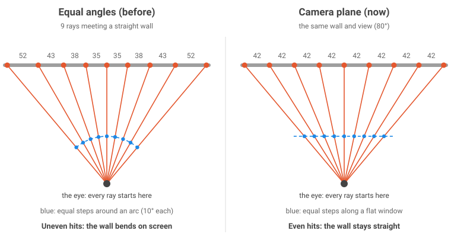
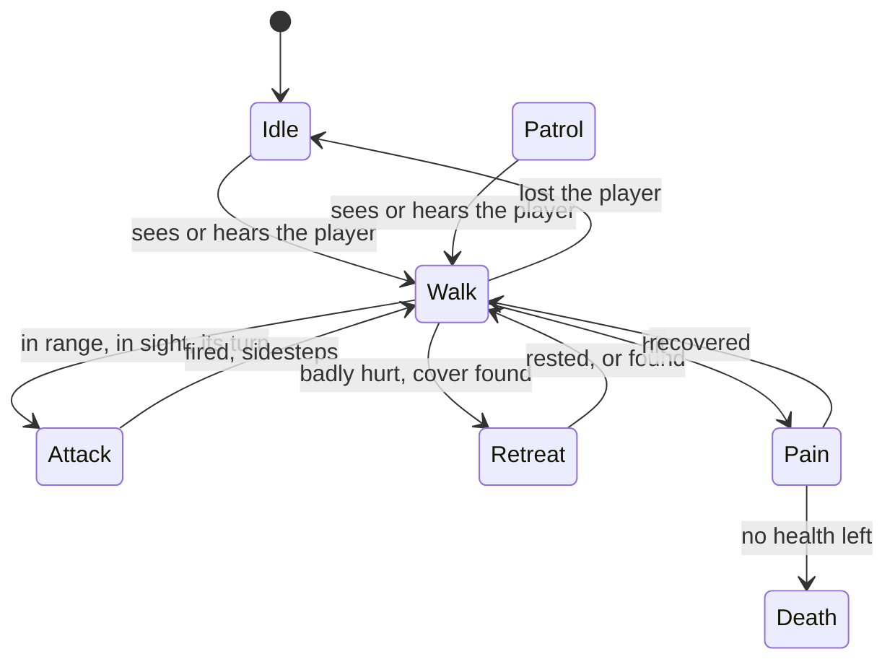

# Algorithms

## Rendering

### Grid traversal: DDA

Walks a ray from \(O\) along \(D = (\cos\phi, \sin\phi)\) through the
cells it crosses, in order, to the first wall (Amanatides and Woo's
traversal, in 2D).

- Crossings of vertical grid lines are \(\Delta t_x = |1/D_x|\) apart along
  the ray, of horizontal ones \(\Delta t_y = |1/D_y|\).
- Keep the distance to the next crossing on each axis; step the smaller
  one into the next cell; stop at a wall (or a door the ray meets).

Used for walls, line of sight and aiming. Code: `src/Camera/`.

### Projection

- **Perpendicular distance** removes the fishbowl bulge:
  \(d_\perp = t \cos(\phi - \theta)\).
- **Wall height** on screen: \(h = P / d_\perp\), with \(P\) the pixels a
  unit is tall one unit away.
- **Rays through a flat camera plane**, not at equal angles: column \(x\)
  looks along \(\phi\) with \(\tan\phi = x \tan(\text{FOV}/2)\),
  \(x \in [-1, 1]\), so straight walls stay straight.
- **Texture column**: the fractional part of the hit point along the face,
  times the texture's width.

<figure markdown="span">
  { width="600" }
</figure>

### Painter's algorithm with billboards

- Every wall strip, sprite and decal goes into a queue with its distance;
  the queue is sorted far to near and drawn in order. A sprite behind a
  pillar is covered by the pillar's nearer strips: no depth buffer.
- Sprites are billboards: scaled like walls by their distance, turned to
  face the viewer. An enemy has eight pictures; the one shown depends on
  the angle between its facing and the viewer.
- Ties keep their submission order (an `order` field), so an unstable,
  allocation-free sort is enough.

Code: `src/Graphics/src/renderer_3d.cpp`, `src/Camera/src/camera.cpp`.

## Simulation

### Fixed timestep with interpolation

```text
accumulator += min(frame_time, 0.25 s)
while accumulator >= 1/60 s:  tick(); accumulator -= 1/60 s
alpha = accumulator / (1/60 s)          # draw alpha of the way to the next tick
```

Positions are drawn \(p = p_{prev} + (p - p_{prev})\,\alpha\); angles take
the short way round, `std::remainder(b - a, 2π)`.

Code: `src/TimeManager/`.

### Collision

- **Walls**: a square body; only the edge moving **towards** a wall is
  tested, at both corners (pulled in by 1% so a body can slide along a
  wall); x and y are moved and tested separately, so a blocked axis still
  lets the other slide.
- **Bodies**: circles; a step ending inside another body is pushed out
  along the line between the centres, onto its edge; a step moving away is
  always allowed, so nothing gets stuck.

Code: `src/CollisionManager/`.

## Enemies

### State machine



### Hearing: breadth-first flood fill

A shot starts a BFS from its cell through open cells (walls and closed
doors stop it), up to the weapon's noise range in steps; every enemy in a
reached cell is alerted. Sound goes round corners, not through walls.
Buffers are sized once per level.

Code: `Scene::MakeNoise`.

### Pathfinding: weighted A\*

- **Grid**: each map cell is split into 2 × 2, 4-connected.
- **Cost**: \(f = (1 - w)\,g + w\,h\), \(w = 0.6\), \(h\) the straight-line
  distance: faster than plain A\*, paths at most 1.5 times the shortest
  (on these open rooms, usually the shortest).
- **Extra step costs**: +3 on other enemies' next 16 cells (groups split
  up), +4 beside lamps; cells with other enemies are blocked.
- **Open set**: a binary heap; a cell reached more cheaply is pushed again
  and the stale entry skipped when popped (no decrease-key).
- **No clearing between queries**: each cell's state carries a generation
  stamp, valid only if it equals the current query's; starting a query is
  one increment.

Code: `src/NavigationManager/src/grid_path_finder.cpp`.

## Combat

### Hitscan against a picture

For a target at distance \(d\) and a shot along \(\hat f\) from the eye:

- the shot crosses the target's board (facing the shooter) at
  \(along = d / (\hat f \cdot \hat t)\);
- **across** the picture: \(0.5 + (\hat f \cdot along - \vec t) \cdot \hat r / width\);
- **down** the picture: \(1 - (0.5 + pitch \cdot along) / height\)
  (the eye is half a wall up, the shot climbs with the pitch);
- it hits if both are in \([0, 1)\) and the picture's **mask** is solid
  there; the zone comes from how far down the solid part it crossed: head
  (top 20%, ×2 damage), body, legs (bottom 45%, ×0.6).

Pellets are fanned evenly across the weapon's spread, each resolved alone.

### Damage over distance

- Linear: \(dmg = min + (max - min)\,\frac{range - d}{range}\)
- Exponential (shotguns): \(dmg = \operatorname{clamp}(e^{(range - d)/1.5}, min, max)\)

### Projectiles

Moved in steps of 0.05 cells (less than any body is wide) so nothing is
passed through; bursts on a wall, a body or a lamp. The blast hurts each
body in reach and in line of sight, falling off linearly to its edge; the
shooter takes half.

Code: `src/ShootingManager/`, `Scene::Fly`, `Scene::Burst`.

## Audio

### Positional gains

For a sound at distance \(d\) and bearing \(\phi\), heard facing \(\theta\):

- loudness \(g = r^2\), \(r = \operatorname{clamp}\left(\frac{24 - d}{22}, 0, 1\right)\),
  times 0.45 through a wall;
- pan \(s = 0.8 \sin(\phi - \theta)\);
  \(g_L = g \min(1, 1 - s)\), \(g_R = g \min(1, 1 + s)\).

### Lock-free single-producer, single-consumer ring

The game thread writes a command into a fixed array and publishes it with
a **release** store of its counter; the audio thread reads up to that
counter with an **acquire** load, and publishes what it took the same
way. Free-running 32-bit counters: `sent - taken` is the count in flight,
even after they wrap.

Code: `src/SoundManager/src/spatial_mixer.cpp`.

## Memory

- **Arena**: bumps **downwards** from the end of one block, so aligning is
  one mask (`& ~(alignment - 1)`); never grows (running out is an error);
  `Reset()` frees a whole level at once.
- **Pools with generational handles**: a handle is an index plus the
  slot's generation; freeing a slot bumps its generation, so an old handle
  to a reused slot is detected instead of reaching the wrong object.

Code: `src/Allocators/`.

## Networking

The algorithms of the match (prediction and reconciliation, snapshot
interpolation, lag compensation, the command queue, spawn choice, round
trips) are on the [Multiplayer](multiplayer.md) page.

## Downloading

- The file is split into 1 MB byte ranges, fetched over 4 connections.
- Each read has a 2 s watchdog; a piece that stalls is re-requested from
  the byte it reached, on a new connection (up to 30 times without
  progress).
- Pieces are streamed out in order as they complete, so the WebAssembly
  compiles while the rest downloads.
- The result is kept in IndexedDB under the server's size and date, and
  reused while they match.

Code: `web/shell.html`.
