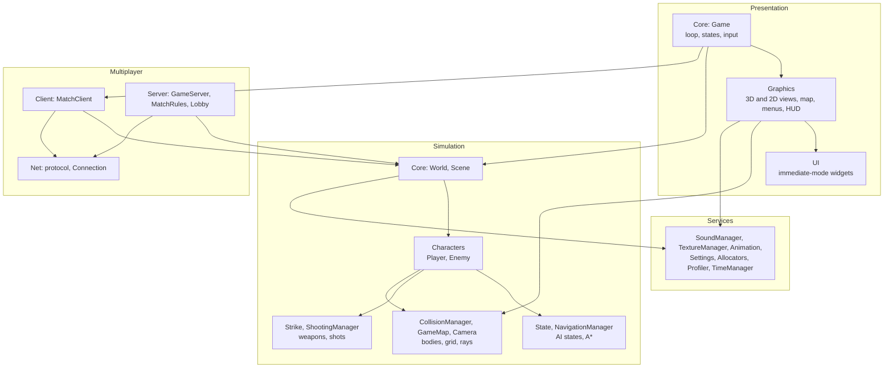
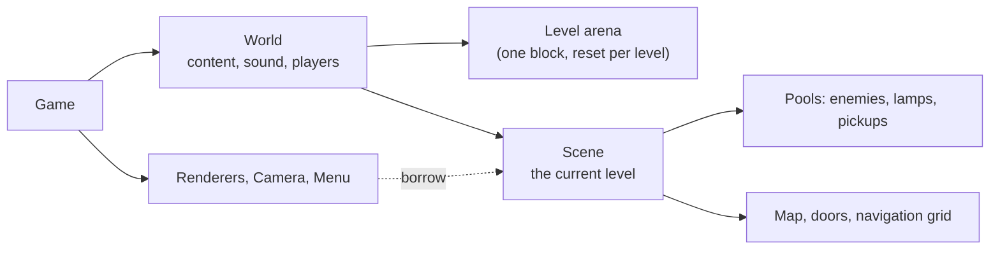
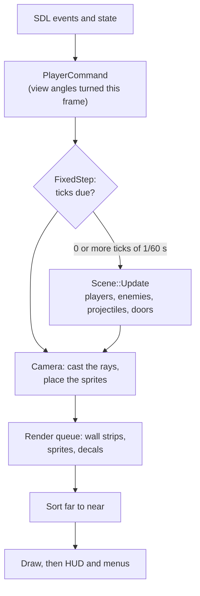
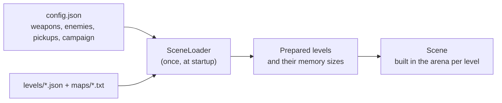

# Architecture

Two programs share one engine: the game, `karakale`, and the
multiplayer server, `karakale-server`. Each directory under `src/` is a
small static library.

## Two halves

- **Simulation** (`World`, `Scene`, player, enemies, map, pathfinding,
  weapons, collision): advances in fixed ticks from `PlayerCommand`s and
  knows nothing of the screen, keyboard or network.
- **Presentation** (`Game`, renderers, menus, HUD): reads input into
  commands, and draws the simulation's state as often as the display
  allows.

The same simulation runs in three places: a single-player game, a
player's game during a match, and the server.

## Modules

## Ownership

One owner for everything, so lifetimes are plain:

- The `World` owns the content (read at startup), the sound, up to eight
  players and the current `Scene`.
- The `Scene` lives in the level arena; its objects live in fixed pools.
- Renderers, the camera and the enemies **borrow** the scene; nothing is
  shared or reference-counted.

## A frame

- The view is drawn `alpha` of the way between the last two ticks, so
  motion is smooth at any frame rate.
- In a match, `MatchClient` wraps each tick: it sends the command before
  and places the other players after (see [Multiplayer](multiplayer.md)).

## Content

Everything a level needs is read and sized at startup, so starting a level
allocates nothing.
