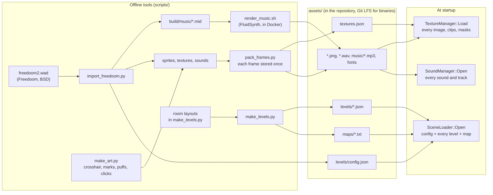
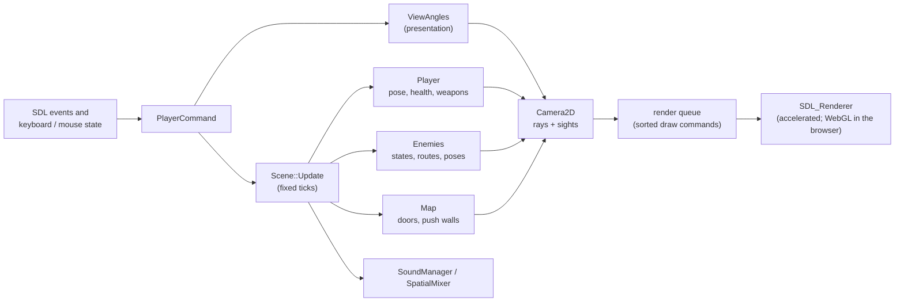
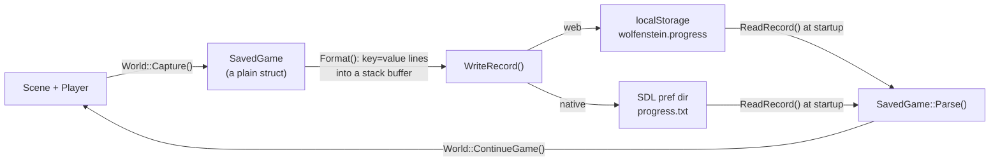

# Data flow

Data moves through the engine along three paths: **content**, from source
art and room layouts to the files the game reads at startup; **state**,
from input through the simulation to the screen, every frame; and
**progress**, from the running game to a saved record and back.

## Content: from sources to startup



Everything the game will need is read **once, at startup**. The loader
parses `config.json` (with nlohmann/json's tree API) and then every level
the campaign names, plus the benchmark's, each into a `PreparedLevel`: the
parsed `LevelData` (read with a streaming SAX parser, see
[Streaming JSON with SAX](../techniques/sax-parsing.md)), its `Map`, and the
`SceneCapacity` the level needs (how many enemies, lamps, pickups and
secrets).

```cpp title="src/Core/src/scene_loader.cpp"
std::expected<SceneLoader, std::string> SceneLoader::Open(
    std::string asset_dir) {
    auto config = ParseFile(asset_dir + "levels/config.json", ParseGameConfig);
    if (!config) {
        return std::unexpected(config.error());
    }
    SceneLoader loader(std::move(asset_dir), std::move(*config));
    for (const std::string& file : loader.config_.levels) {
        if (auto prepared = loader.Prepare(file); !prepared) {
            return std::unexpected(prepared.error());
        }
    }
    if (auto prepared = loader.Prepare(loader.config_.benchmark_level);
        !prepared) {
        return std::unexpected(prepared.error());
    }
    return loader;
}
```
[View on GitHub](https://github.com/bilalkah/wolfenstein/blob/73aaf653bbc3b5dbb26be73432bb845df5e76c52/src/Core/src/scene_loader.cpp#L56-L73){ .excerpt-source }

While preparing, the loader also works out the largest arena any level
needs, so the `World` can take one block of that size up front.

## Starting a level

Starting a level only reads what is already in memory:

```cpp title="src/Core/src/world.cpp"
std::expected<void, std::string> World::StartLevel(
    std::string_view level_file) {
    if (!player_) {
        return std::unexpected("no game started");
    }
    const PreparedLevel* level = loader_.FindLevel(level_file);
    if (level == nullptr) {
        return std::unexpected("unknown level " + std::string(level_file));
    }
    // The previous level lives in the arena: it goes before the arena is
    // reused for the next one
    scene_.reset();
    level_memory_.Reset();
    scene_.emplace(textures_, *sound_, level->map, level->capacity,
                   level_memory_);
    level_ = level;
    scene_->SetDifficulty({.enemy_damage = difficulty_->enemy_damage,
                           .enemy_health = difficulty_->enemy_health,
                           .supplies = difficulty_->supplies,
                           .attackers = difficulty_->attackers});
    sound_->PlayMusic(level->data.music);
    return loader_.Populate(*scene_, *level, *player_, seed_);
}
```
[View on GitHub](https://github.com/bilalkah/wolfenstein/blob/73aaf653bbc3b5dbb26be73432bb845df5e76c52/src/Core/src/world.cpp#L240-L262){ .excerpt-source }

1. The old `Scene` is destroyed, and the arena it lived in is rewound.
2. A new `Scene` is built **in place** (`std::optional::emplace`) with a
   copy of the level's map whose cells live in the arena, and object pools
   sized exactly for this level.
3. `SceneLoader::Populate` adds the enemies, lamps and pickups, the drops
   each enemy may carry (rolled from the game's seed), the secrets and the
   intel, sets the objectives, places the player and builds the
   pathfinding grid.

## State: from input to the screen, every frame



The simulation never reads an input device and never draws. What crosses
from the presentation into the simulation is one `PlayerCommand` per tick;
what crosses back is read-only state (poses, health, the map) that the
camera and renderers look at. See [Input](../engine/input.md) and
[One frame, input to pixels](frame-lifecycle.md).

## Progress: saving and continuing



A saved game records the level, the difficulty, the game's random seed, the
player's health, weapons and rounds, where they stand, and what is done in
the level (enemies killed, pickups taken, secrets pushed, intel read and
cells explored) as bit sets. Saving happens while the game runs, so it
allocates nothing: the record is formatted with `std::to_chars` into a
buffer on the stack. See [Settings and saved games](../engine/persistence.md).
