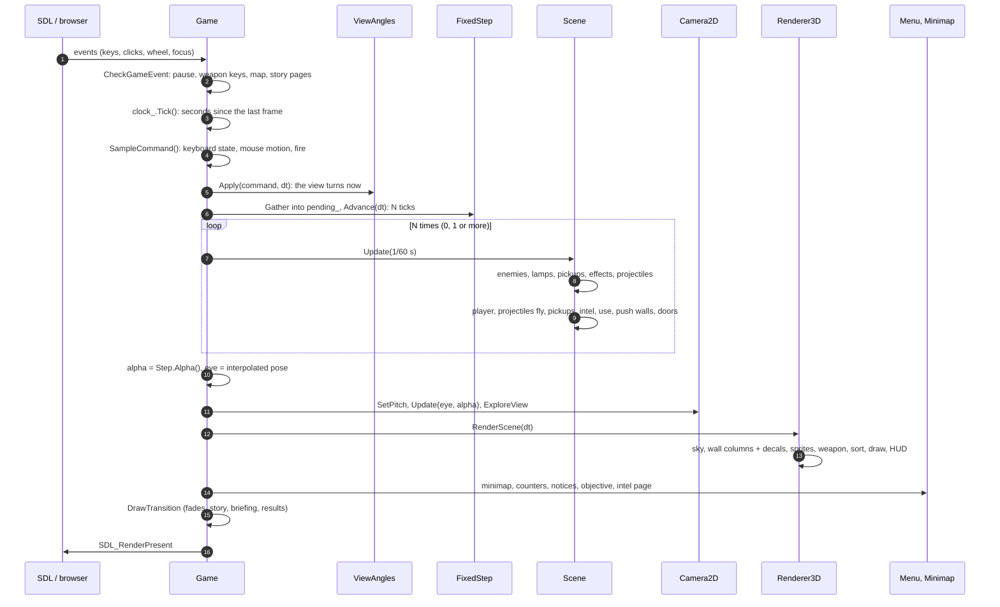

# One frame, input to pixels

This page follows a single frame of play through the engine, in the order
the code runs it. Almost every subsystem appears once; each has its own
page under [Engine](../engine/index.md).

## Who calls the frame

On the desktop, `Game::Run` is a plain loop; in the browser, the browser
owns the loop and calls back once per animation frame:

```cpp title="src/Core/src/game.cpp"
void Game::Run() {
#ifdef __EMSCRIPTEN__
    // Loaded: the page stops watching for a start that failed (see
    // web/shell.html)
    EM_ASM(if (Module.onGameReady) Module.onGameReady(););
    // The browser drives the loop: one Tick per animation frame
    emscripten_set_main_loop_arg(
        [](void* game) {
            if (!static_cast<Game*>(game)->Tick()) {
                emscripten_cancel_main_loop();
            }
        },
        this, 0, true);
#else
    while (Tick()) {}
#endif
}
```
[View on GitHub](https://github.com/bilalkah/wolfenstein/blob/73aaf653bbc3b5dbb26be73432bb845df5e76c52/src/Core/src/game.cpp#L547-L563){ .excerpt-source }

`Tick` dispatches on the game state (`Menu`, `Playing`, `Paused`,
`Result`). While playing, `GameTick` wraps the frame in the profiler's
`Frame` section and, natively, sleeps to cap the frame rate at the
configured 120 Hz (`FrameClock::SleepForHz`); in the browser,
`requestAnimationFrame` paces the frames instead.

## The frame, step by step



1. **Events.** `CheckGameEvent` drains SDL's queue. Events that must not
   be missed between frames are latched into members: a click
   (`clicked_`), the mouse wheel (`wheel_`) and a number key
   (`weapon_key_`). Esc pauses, M toggles the map, and losing focus (or,
   in the browser, losing pointer lock) pauses too.
2. **Frame time.** `FrameClock::Tick` measures the seconds since the last
   frame, or returns a fixed step in scripted runs.
3. **Input.** `SampleCommand` reads the keyboard *state* (which keys are
   down now) and the mouse motion since the last call into a
   [`PlayerCommand`](../engine/input.md).
4. **The view turns at once.** `ViewAngles::Apply` adds this frame's mouse
   motion to the view angles immediately, so the picture follows the hand
   at any frame rate; the command then carries the angles outright.
5. **Fixed ticks.** Commands of frames between two ticks are merged
   (`Gather`: mouse motion adds up, a click in any frame counts), and
   `FixedStep::Advance` says how many 1/60 s ticks this frame's time buys.
   See [Main loop and timing](../engine/main-loop.md).

```cpp title="src/Core/src/game.cpp"
    // The simulation advances in fixed ticks, whatever the frame rate, so
    // the same commands always play out the same way. A long stall (a
    // breakpoint, a hidden browser tab) is dropped rather than caught up in
    // a burst of ticks. A frame with no tick keeps its input for the next.
    pending_ = Gather(pending_, command);
    int ticks = step_.Advance(clock_.DeltaTime());
    if (ticks > 0) {
        world_->GetPlayer().SetCommand(pending_);
        pending_ = {};
    }
    for (; ticks > 0; --ticks) {
        // The level waits behind its results screen and the next briefing
        if (fade_ != Fade::Stats && fade_ != Fade::Story &&
            fade_ != Fade::Briefing) {
            world_->CurrentLevel().Update(step_.TickSeconds());
        }
    }
    // Frames fall between ticks: the view is drawn this far from the last
    // tick towards the next, so motion stays smooth at any frame rate
    const double alpha = step_.Alpha();
    const Position2D eye = ViewPosition(alpha);
    // Sounds from places are heard from where the view is
    world_->Sound().SetListener(eye.pose, eye.theta);
    {
        ScopedTimer timer(ProfileSection::Camera);
        camera_->SetPitch(ViewPitch(alpha));
        camera_->Update(eye, alpha);
        camera_->ExploreView();
    }
    AutoSave(clock_.DeltaTime());
    RenderView(eye);
    DrawTransition();
    ScopedTimer timer(ProfileSection::Present);
    Present();
```
[View on GitHub](https://github.com/bilalkah/wolfenstein/blob/73aaf653bbc3b5dbb26be73432bb845df5e76c52/src/Core/src/game.cpp#L752-L785){ .excerpt-source }

6. **The simulation tick.** `Scene::Update` advances every object in the
   level, then the player, then the rest of the level's systems:

    ```cpp title="src/Core/src/scene.cpp"
    void Scene::Update(double delta_time) {
        if (number_of_alive_enemies > 0) {
            elapsed_ += delta_time;
        }
        {
            ScopedTimer timer(ProfileSection::UpdateEnemies);
            for (IGameObject* object : objects_) {
                object->Update(delta_time);
            }
        }

        ScopedTimer timer(ProfileSection::UpdatePlayer);
        player_->Update(delta_time);
        FlyProjectiles(delta_time);
        CollectPickups();
        ReadIntel();
        notice_time_ += delta_time;
        since_document_ += delta_time;
        HandleUse();
    ```
    [View on GitHub](https://github.com/bilalkah/wolfenstein/blob/73aaf653bbc3b5dbb26be73432bb845df5e76c52/src/Core/src/scene.cpp#L373-L391){ .excerpt-source }

    Each enemy casts a line of sight to the player, runs its
    [state machine](../engine/ai.md) (which may plan a path with
    [A*](../engine/navigation.md) or fire), and moves with
    [collision](../engine/collision.md). The player switches weapons,
    fires or reloads, moves and turns. After that, projectiles fly, pickups
    are collected, intel is read, the use key opens doors or secret walls,
    secret walls slide and doors open or close. The rest of `Update`
    (after the excerpt) advances the push walls and the doors.

7. **Interpolation.** A frame usually falls between two ticks. `alpha` (0
   to 1) says how far; the player and the enemies are drawn at their pose
   interpolated between the previous tick and the latest
   (`GetRenderPosition`, `GetRenderPose`), while the view's angle comes
   from `ViewAngles` directly.
8. **Listening.** The positional audio mixer is told where the ear is and
   which way it faces; sounds already playing are panned afresh.
9. **Casting.** `Camera2D::Update` casts `width / 2` rays with the
   [DDA](../engine/raycasting.md), works out each visible object's left and
   right edge on screen, and `ExploreView` marks what the rays crossed as
   explored, for the map.
10. **Drawing.** `Renderer3D::RenderScene` builds a queue of draw commands
    (wall column strips, pictures on walls, sprites, the weapon), sorts it
    back to front and draws it; then the HUD. `Game::RenderView` adds the
    minimap, the kill counter, the weapon slots, notices, the objective
    and any page of intel being read. See [The 3D renderer](../engine/renderer.md).
11. **Transitions.** `DrawTransition` draws what lies over the level between
    levels: the fade to black, the results, a page of story, the next
    briefing.
12. **Present.** `SDL_RenderPresent` shows the frame.

## What each step costs

The profiler times each of these as a section: `Frame`, `UpdateEnemies`,
`Pathfinding`, `LineOfSight`, `UpdatePlayer`, `Camera`, `Render`,
`RenderWalls`, `RenderObjects`, `RenderDraw`, `RenderHud` and `Present`
(`src/Profiler/include/Profiler/profiler.h`). Sections nest, so they do not
add up to `Frame`. The [benchmark](../engine/profiling.md) prints them per
frame, together with the heap allocations each section made: CI requires
that number to be zero.

## Pitfalls in this order

!!! warning "The player shoots and moves before it turns"
    `Player::Update` calls `ShootOrReload()` and `Move()` before
    `Rotate()`:

    ```cpp title="src/Characters/src/player.cpp"
        SwitchWeapons();
        ShootOrReload();
        GetWeapon(held_).Update(delta_time);
        // The gun in hand is down: the next comes up, afresh, not mid-shot or
        // mid-reload from the last time it was held
        if (const auto next = coming_; next && GetWeapon(held_).IsDown()) {
            held_ = *next;
            coming_.reset();
            GetWeapon(held_).TransitionTo(WeaponStateType::Raising);
        }
        Move(delta_time);
        Rotate(delta_time);
        damage_animation_.Update(delta_time);
    }
    ```
    [View on GitHub](https://github.com/bilalkah/wolfenstein/blob/73aaf653bbc3b5dbb26be73432bb845df5e76c52/src/Characters/src/player.cpp#L124-L137){ .excerpt-source }

    `Rotate()` is what takes the command's view angles. A shot fired in a
    tick is therefore aimed with the angle the *previous* tick took, and
    the step is taken in the previous facing too: up to one tick
    (1/60 s) of turning behind the crosshair the player saw when they
    clicked. The test `ViewAimTest.ThePlayerTakesTheViewAtTheTick`
    checks the pose *after* the tick, not the shot fired in it. Calling
    `Rotate()` first would make shots go exactly where the crosshair was
    drawn, which is what commit `d41e706` ("Aim where you look") set out
    to do.

!!! note "Frames with no tick"
    At more than 60 frames a second, most frames run no tick: they only
    draw, from interpolated poses. Their input is kept in `pending_` and
    reaches the simulation with the next tick, so a click shorter than a
    tick is never lost.
