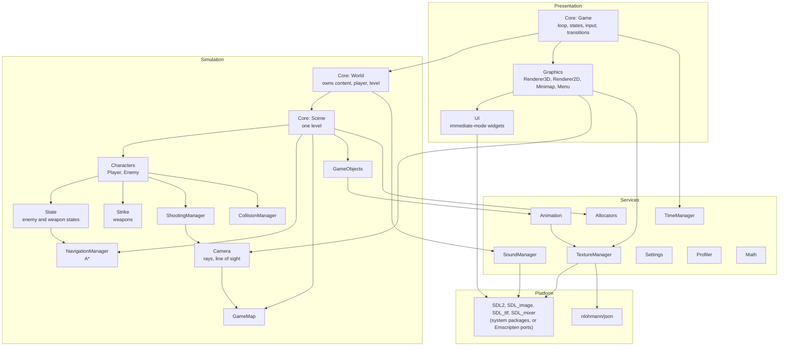
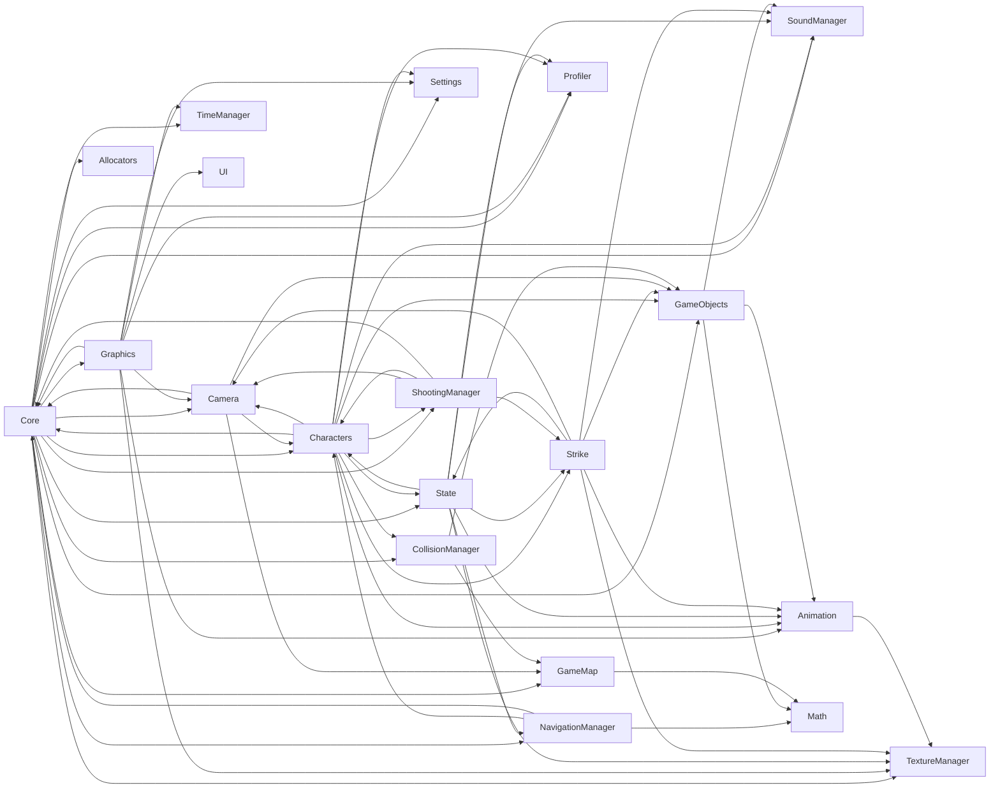

# The big picture

The engine is one executable, `wolfenstein`, built from about twenty small
static libraries (one per directory under `src/`) and a `main.cpp`. It has
two halves that are kept apart on purpose:

- the **simulation** (`World`, `Scene`, the player, the enemies, the map,
  pathfinding, weapons, collision), which advances in fixed ticks and knows
  nothing about the screen, the keyboard or the mouse; and
- the **presentation** (`Game`, the renderers, the menus, the HUD), which
  reads input, turns it into `PlayerCommand`s for the simulation, and draws
  the simulation's state as often as the display allows.

The simulation can be built without a window: the unit tests create a
`World` or a `Scene` directly, and a comment in `World` notes that "a
server can create worlds of their own".

## Code map

| Directory | Subsystem | Responsibility |
| --- | --- | --- |
| `app/` | Entry point | `main.cpp` picks the mode (`--debug`, `--benchmark N`, `--soak`) and runs the `Game`; `allocation_counter.cpp` replaces the allocator to count heap allocations |
| `src/Core/` | Game, world, level | `Game` (loop, game states, input sampling, level transitions, story), `World` (owns the simulation), `Scene` (one level: its objects, doors, noise, sounds, stats), `SceneLoader` and `level_data` (reading `config.json` and level files), `story.h` |
| `src/TimeManager/` | Timing | `FrameClock` (time between frames), `FixedStep` (turns frame time into fixed ticks) |
| `src/Camera/` | Raycasting | `Camera2D` (the fan of rays, each object's place on screen), `RayCaster` (DDA), `CastRay`, `CastLineOfSight`, `Ray` |
| `src/Graphics/` | Rendering | `Renderer3D` (walls, sprites, decals, sky, weapon, HUD), `Renderer2D` (the developer's top-down view), `Minimap`, `Menu` (menus, story pages, briefings, notices), `RendererResult`, `RendererContext` (the SDL window, renderer, font and textures), `QuadBatch` |
| `src/GameMap/` | The map | `Map`: the grid of cells, sliding doors, secret push walls, the exit |
| `src/CollisionManager/` | Collision | Wall collision for a square body, pushing a round body out of others |
| `src/GameObjects/` | Things in a level | `IGameObject` and its kinds: `Pickup`, `Projectile`, `Effect`, `DynamicObject` (lamps), `StaticObject`; `ObjectId` |
| `src/Characters/` | Player and enemies | `Player`, `Enemy`, `PlayerCommand`, `ViewAngles` |
| `src/State/` | State machines | `State<T>`, `StateMachine<S>`, the enemy states (idle, patrol, walk, attack, pain, death, retreat) and the weapon states (loaded, out of ammo, reloading, raising, lowering) |
| `src/Strike/` | Weapons | `Weapon` (the player's), `SimpleWeapon` (an enemy's) |
| `src/ShootingManager/` | Shots | `Aim`, `Cross`, resolving the player's and enemies' shots, damage falloff, bullet marks |
| `src/NavigationManager/` | Pathfinding | `GridPathFinder` (weighted A*), `NavigationManager` (the enemies' routes) |
| `src/SoundManager/` | Audio | `SoundManager` (SDL_mixer: effects, music, channels), `SpatialMixer` (positional sound) |
| `src/TextureManager/` | Textures | `TextureManager` and its manifest (`assets/textures.json`): images, wall textures, animation clips, sprite masks |
| `src/Animation/` | Animation | `LoopedAnimation` (clips seen from 8 sides), `TriggeredSingleAnimation` (fades) |
| `src/Allocators/` | Memory | `MonotonicArena`, `ObjectPool` with generational `Handle`s, AddressSanitizer poisoning |
| `src/Profiler/` | Measurement | `Profiler`, `ScopedTimer`, `AllocationStats` |
| `src/Settings/` | Persistence | `Settings`, `SavedGame`, record storage (a file natively, `localStorage` on the web) |
| `src/UI/` | UI toolkit | A small immediate-mode UI over `SDL_Renderer`: buttons, sliders, toggles, text from pre-rasterised glyphs |
| `src/Math/` | Maths | `vector2d`, `vector2i`, angle helpers |
| `assets/` | Content | `textures.json`, `levels/config.json`, `levels/*.json`, `maps/*.txt`, images, sounds, music, fonts, `licenses/` |
| `scripts/` | Tooling | Level generator, art importers, builds, dev container, lint, CI checks |
| `web/shell.html` | Web page | The page the WebAssembly build runs in: loading, caching, pointer lock, audio unlock |
| `tests/`, `benchmarks/` | Checks | GoogleTest unit tests; the web benchmark and soak runners; micro-benchmarks |

## Layers

The arrows are the main "uses" relations, simplified from the link
dependencies each module declares in its `CMakeLists.txt`.

## The module dependency graph

Each directory builds one or more static libraries and names what it links
against. Collapsed to directories, the graph is:

It is not a strict hierarchy. The `scene` library (in `Core/`) links
`character`, `navigation_manager` and `collision_manager`; `character`,
`navigation_manager`, `shooting_manager` and `camera` link `scene` back.
CMake resolves cycles between static libraries by repeating them on the
link line, so this builds, but it means `Scene` and the characters are one
unit in practice: an enemy reaches the map, the player and the navigation
through its `Scene&`, and the scene updates the enemies.

!!! todo "Bilal: explain why"
    Why the libraries are split per directory even where they depend on
    each other both ways. A guess: the split follows the original 2024
    layout (one package per concept, as in the first UML diagram,
    `project.drawio.png`), and the 2026 CMake overhaul (`a2929f3`, "Move
    to target-based CMake") kept the packages as targets rather than
    redraw the boundaries.

## Where to go next

- [One frame, input to pixels](frame-lifecycle.md): the order in which all
  of this runs.
- [Data flow](data-flow.md): content from files into the running game, and
  state from the simulation to the screen and to saved games.
- [Ownership and lifetimes](ownership.md): who owns what, what borrows
  what, and why so many types cannot be copied or moved.
