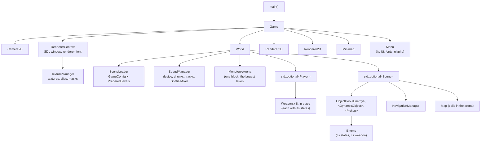

# Ownership and lifetimes

C++ leaves it to the program to say who owns each object and how long it
lives. This engine answers with a simple rule, applied everywhere: **every
object has exactly one owner, and everything else borrows it, for less
time than the owner keeps it.** There is no shared ownership: the code has
no `std::shared_ptr` at all (the last ones went in `39846c6`, "Fix the
shared_ptr ownership cycle in the state machines", which leaked every
enemy and state).

## The ownership tree



Borrowing (not shown as arrows): the scene borrows the textures, the sound
manager and the arena; enemies borrow their scene and their `EnemyConfig`
(in the loader's `GameConfig`); weapons borrow their `WeaponConfig`, the
textures and the sound; the renderers borrow the `RendererContext` and the
current `Scene`; the camera borrows the scene.

## Declaration order is destruction order

C++ destroys members in the reverse order of their declaration. The engine
leans on that instead of writing destructors: members are declared in
dependency order, so what borrows is destroyed before what it borrows from.

```cpp title="src/Core/include/Core/game.h"
    // Declared in dependency order, destroyed in the reverse: the views,
    // which borrow the world, then the world (level, player, sound), then
    // the renderer context (textures, then the SDL renderer and SDL itself)
    std::unique_ptr<Camera2D> camera_;
    std::unique_ptr<RendererContext> renderer_context_;
    std::unique_ptr<World> world_;
    // Both views are built once; switching between them (P, debug) swaps the
    // pointer instead of building a renderer each time
    std::unique_ptr<Renderer3D> renderer_3d_;
    std::unique_ptr<Renderer2D> renderer_2d_;
```
[View on GitHub](https://github.com/bilalkah/wolfenstein/blob/fab3414ad0f99c23307e2a7cb6a5b7beaadb0f61/src/Core/include/Core/game.h#L172-L181){ .excerpt-source }

The same inside the `World`:

```cpp title="src/Core/include/Core/world.h"
    const TextureManager& textures_;
    SceneLoader loader_;
    std::unique_ptr<SoundManager> sound_;
    memory::MonotonicArena level_memory_;
    std::optional<Player> player_;
    std::optional<Scene> scene_;
```
[View on GitHub](https://github.com/bilalkah/wolfenstein/blob/fab3414ad0f99c23307e2a7cb6a5b7beaadb0f61/src/Core/include/Core/world.h#L130-L135){ .excerpt-source }

`scene_` goes first: it borrows the player, the sound and the arena. Then
the player, which borrows the sound; then the arena; then the sound
manager, which closes the audio device; then the loader, whose
`GameConfig` every enemy and weapon had borrowed.

## Lifetimes, from longest to shortest

| Lifetime | Objects | Where their memory is |
| --- | --- | --- |
| The program | `Game`, `RendererContext`, `TextureManager`, `Menu`, the renderers, `World`, `SceneLoader` and its `GameConfig`, `SoundManager` | Heap, allocated at startup |
| A game (new or continued) | `Player`, built in place in `World::player_` | Inside the `World` object |
| A level | `Scene`, its map cells, pools, lists, navigation buffers | The `World`'s arena, rewound for each level |
| A tick or a frame | Commands, rays, the render queue's contents | Reused members (the queue keeps its capacity) and the stack |

Two `std::optional` members do what would otherwise need heap allocations:
`World::player_` and `World::scene_` are *places* for a player and a scene,
built with `emplace` and destroyed with `reset`, so starting a game or a
level allocates nothing new.

## Pinned objects

Many types delete their copy and move operations. The reason, repeated in
the code's comments, is always the same: **something points back into
them.**

| Type | What points into it |
| --- | --- |
| `Player`, `Enemy`, `Weapon` | Their states hold a pointer to them (`State<T>::context_`) |
| `StateMachine<S>` | It points at states that are members of its owner |
| `Scene` | Its objects, systems (navigation) and the views borrow it |
| `World` | Levels and the player point back into it |
| `ObjectPool<T>`, `MonotonicArena` | Objects and containers hold pointers into their storage |
| `RendererContext`, `TextureManager`, `SoundManager`, `Ui` | They own C resources (SDL textures, fonts, the audio device): a copy would free them twice |

A pinned object lives where it is built. That is why the `World` builds the
player and the scene in place in `std::optional` members, and why pools
build enemies in place in their slots (`std::construct_at`). See
[Special members and pinned types](../techniques/special-members.md).

## Borrowing across a level change

The one moment when borrowers can outlive what they borrow is a level
change: `World::StartLevel` destroys the scene and builds the next one.
Everything that borrows the scene must be pointed at the new one before
it draws again. `Game::ShowLevel` does exactly that, right after the world
replaced its level:

- `renderer_3d_->SetScene(...)`, `renderer_2d_->SetScene(...)`,
  `minimap_->SetScene(...)`;
- the camera gets the scene through the renderer path and sizes its
  per-object views for it (`Camera2D::SetScene`);
- the clock restarts, the fixed step forgets time not yet simulated, and
  the view angles are reset to where the level put the player.

The comment on `World::NewGame` states the contract: "The previous level
and player are gone afterwards: views borrowing them must be pointed at
the new level before they draw again."

### Why a pointer, re-pointed, rather than asking the World

The views keep a plain `Scene*`, set once per level, rather than asking the
`World` for the current level every frame. No reason is recorded: the
`SetScene` calls date from the menus and results of December 2024
(`4da74d4`), long before there was a `World` (`3ff2a23`, September 2026).
What the choice gives and costs today:

- **Nothing per frame**, and the renderers and the camera depend on
  `Scene` alone, not on the `World` and everything it owns.
- **A step per level is needed anyway.** `Camera2D::SetScene` sizes the
  camera's table of per-object views for the new level's objects, which a
  lookup each frame would not do.
- **The price is one rule:** whatever replaces the level must call
  `Game::ShowLevel` before the next frame is drawn. All three paths that
  replace it (a new game, a saved game continued, the next level) do,
  right after the `World` has built the new level. A path that forgot
  would leave the views pointing at a destroyed level; under
  AddressSanitizer, the soak session, which starts new games and goes on
  to next levels, would show it as a use after free.
