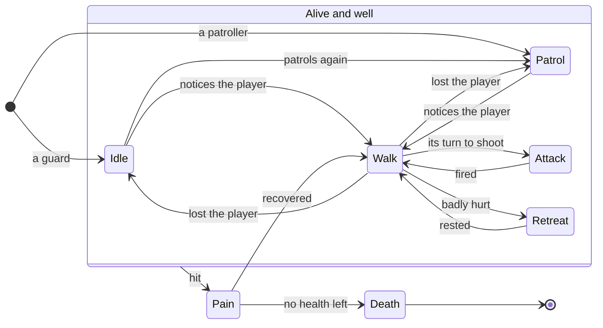

# Enemy AI

## Purpose

Enemies decide, every tick, what to do: stand guard or walk a patrol,
notice the player, hunt them, fight from a range that suits their weapon,
dodge between shots, take turns to shoot, flinch when hit, run for cover
when badly hurt, and die. The aim is enemies that feel like they fight as
a group, from simple, predictable rules.

Code: `src/Characters/src/enemy.cpp`, `src/State/src/enemy_state.cpp`,
`src/State/include/State/state.h`, the `Scene`'s noise and turn-taking,
and each type's tuning in `assets/levels/config.json`.

## Concepts

### Finite state machines

A finite state machine (FSM) is the classic structure for game AI: the
agent is always in one of a few **states**, each state has its own update
logic, and **transitions** move it from one state to another when
conditions hold. It is easy to reason about ("in `Attack`, it fires once,
then goes back to `Walk`") and easy to debug, at the price of rules
spread across states. Robert Nystrom's
[*Game Programming Patterns*: State](https://gameprogrammingpatterns.com/state.html)
describes the pattern and its variants.

### Perception and hearing

Games rarely simulate senses physically. *Doom*'s monsters wake when they
see the player or when a noise reaches their sector through open
connections; this engine does the same on the grid: a gunshot floods
outward through open cells, round corners but not through walls or closed
doors, and wakes every enemy it reaches within the weapon's range.

## How it is implemented here

### The states



In full, each change of state happens when:

| From | To | When |
| --- | --- | --- |
| Idle or Patrol | Walk | it notices the player: sees them near, or hears them |
| Walk | Attack | the player is in range and in sight, its time between shots has passed, and it is its turn |
| Attack | Walk | it has fired; it plans a sidestep |
| Walk | Retreat | it is badly hurt and has found cover (once) |
| Retreat | Walk | it has rested, or the player found it or cornered it |
| Walk | Idle | it has lost the player: far away and unheard |
| Walk | Patrol | a patroller has lost the player |
| Idle | Patrol | after a lost hunt, it patrols again |
| any state in the box | Pain | it is hit (at most once per `pain_cooldown_seconds`) |
| Pain | Walk | it has recovered, and fires back at once |
| Pain | Death | it has no health left |

Each state is a class (`IdleState`, `PatrolState`, `WalkState`,
`AttackState`, `PainState`, `DeathState`, `RetreatState`) that the enemy
holds **as a member**; the state machine only points at the current one,
so a transition allocates nothing. See
[State machines with templates](../techniques/state-machines.md).

### Noticing the player

Every tick, each living enemy casts a line of sight to the player
(`CastLineOfSight`, the same DDA the renderer uses). It notices the player
if it heard them, or sees them within its sight range, **in any
direction**:

```cpp title="src/Characters/src/enemy.cpp"
bool Enemy::NoticesPlayer() const {
    // Heard, or seen near: nothing stands between them. It looks all round
    // (seeing only ahead left guards standing blind while the player walked
    // in behind them), whichever way it faces.
    return IsAlerted() ||
           (IsPlayerInShootingRange() && scene_.GetPlayer().GetPose().Distance(
                                             position_.pose) <= SightRange());
}
```
[View on GitHub](https://github.com/bilalkah/wolfenstein/blob/73aaf653bbc3b5dbb26be73432bb845df5e76c52/src/Characters/src/enemy.cpp#L261-L268){ .excerpt-source }

`SightRange()` is the type's `follow_range` plus two cells: 7 cells for
the soldiers and zombies, 8 for the minigun zombie, 10 for the demon. It
is also how far an enemy keeps hunting a player it has lost sight of.

### Hearing

A shot calls `Scene::MakeNoise(position, range)`: a breadth-first search
from the shot's cell through cells that are not blocked, counting steps,
up to `range` steps; every living enemy standing in a reached cell is
alerted and hunts the player for `alert_seconds` (10 by default), whether
it sees them or not. The buffers are sized once per level in the arena, so
a noise allocates nothing.

- The player's weapons have a `noise_range` each: 10 cells for the pistol
  and the MP5, 12 for the shotgun and the plasma rifle, 14 for the
  double-barrelled shotgun and the rocket launcher, 6 for the saw.
- An enemy's own gunfire is a noise too: "the others within earshot come
  to the fight" (`Enemy::Shoot`).
- An enemy that is shot cries out (`cry_range`, 6 cells), so those near
  it come hunting even if the shot was fired from far away.

### Hunting and tactics

`WalkState` is where the fighting happens. Every type has a preferred
**range band** `[near_range, far_range]` from `config.json` (the soldier's
is 2.5 to 4.5 cells, the demon's 0 to 1.2):

```cpp title="src/State/src/enemy_state.cpp"
    const auto& tactics = context_->GetStateConfig();
    const bool seen = context_->IsPlayerInShootingRange();
    auto& navigation = context_->GetScene().GetNavigation();
    // Out of sight, or further off than it likes to fight, or in a doorway
    // where it would block the others: it closes in, facing the way it goes.
    // On a player it sees it comes round to its own side of them.
    if (!seen || distance > tactics.far_range ||
        (context_->InDoorway() && distance >= tactics.near_range)) {
        // ...
    }
    // Nearer than it likes: it backs away, its gun still on the player
    else if (distance < tactics.near_range) {
        constexpr double kBackingPace = 0.75;
        context_->EndSidestep();
        context_->GetScene().GetNavigation().ResetPath(context_->GetId());
        context_->SetFacePlayer(true);
        context_->SetPace(kBackingPace);
        context_->SetNextPose(context_->BackOffSpot());
    }
    // At its range: between shots it steps aside, the player in its
    // sights; bunched up with another, it moves round to a side of its
    // own; else it stands, and turns as the player moves
    else {
        // ...
    }

    // Its legs move as it does: standing to shoot, it does not step
    if (context_->IsMoving()) {
```
[View on GitHub](https://github.com/bilalkah/wolfenstein/blob/73aaf653bbc3b5dbb26be73432bb845df5e76c52/src/State/src/enemy_state.cpp#L168-L250){ .excerpt-source }

- **Too far, out of sight, or in a doorway:** it closes in, along a path
  from the [pathfinder](navigation.md). On a player it sees it heads for
  its **approach spot**: a point at its range from the player, turned as
  far round from the other engaged enemies as it can be (it scores seven
  bearings, its own and up to a right angle either side, each turn costing
  a little). A group therefore spreads round the player instead of filing
  up behind one another. The spot must be open floor, not a doorway, and
  in the player's sight.
- **Too near:** it backs away, still facing the player, to a spot a step
  away (turned aside if a wall is behind it).
- **At its range:** after each shot it **sidesteps** across the line to
  the player (mostly alternating sides, less where a wall is in the way);
  bunched up with another engaged enemy, it moves round to its own side;
  otherwise it stands and turns to follow the player.

### Taking turns

Before firing, an enemy asks the scene whether it may:

```cpp title="src/Core/src/scene.cpp"
bool Scene::MayAttack(const Enemy& enemy) const {
    const auto attacking =
        std::ranges::count_if(enemy_list_, [&](const Enemy* other) {
            return other != &enemy &&
                   other->GetStateType() == EnemyStateType::Attack;
        });
    return attacking < difficulty_.attackers;
}
```
[View on GitHub](https://github.com/bilalkah/wolfenstein/blob/73aaf653bbc3b5dbb26be73432bb845df5e76c52/src/Core/src/scene.cpp#L237-L244){ .excerpt-source }

The limit is the difficulty's `attackers`: 2 on Easy, 3 on Normal, 4 on
Hard. The others keep moving meanwhile. This is the single biggest
difference between a fair fight and a firing squad.

### Firing, and never missing

`AttackState` turns the enemy to the player, plays its attack sound and
fires once. An enemy's shot **always hits**: it only fires with the
player in sight and within its weapon's range, and the damage falls off
linearly from the weapon's point-blank figure to its figure at range,
scaled by the difficulty (`ResolveEnemyShot`). Dodging is therefore about
breaking line of sight and staying out of range, and about the turn limit
above.

### Pain and retaliation

A hit makes an enemy flinch (`Pain`) at most once per
`pain_cooldown_seconds` (1.2 s by default); hits in between only hurt it.
Out of its pain, it fires back at once rather than waiting its rate.
Before this rule (`e024275`, "Let enemies shoot back under steady fire"),
a player firing steadily could keep an enemy flinching forever.

```cpp title="src/Characters/src/enemy.cpp"
bool Enemy::TakeHit() {
    if (!is_attacked_) {
        return false;
    }
    is_attacked_ = false;
    if (health_ > 0.0 &&
        since_flinch_ < config_.behaviour.pain_cooldown_seconds) {
        return false;
    }
    since_flinch_ = 0.0;
    retaliating_ = true;
    return true;
}
```
[View on GitHub](https://github.com/bilalkah/wolfenstein/blob/73aaf653bbc3b5dbb26be73432bb845df5e76c52/src/Characters/src/enemy.cpp#L243-L255){ .excerpt-source }

### Retreat

Types with a `retreat_below` share (the soldier's 0.3, the shotgun
zombie's 0.25) break off **once** when their health drops below it: they
choose the nearest reachable spot out of the player's sight and not
towards them (`FindCover`), run there at 1.25 times their pace, wait up to
four seconds facing the way the player would come, then come back hunting.
Found in cover, or caught close on the way, they fight at once.

### Patrols and guards

Enemies placed with a `patrol_radius` walk about their post, spot to spot:
open floor within the radius, in sight of the post (so never through a
wall into the next room), at half their hunting pace. The others stand
guard and look one way, then another, every 2.2 seconds. Each enemy draws
its choices from **its own** xorshift generator, so a level plays the same
every time:

```cpp title="src/Characters/src/enemy.cpp"
double Enemy::NextRandom() {
    random_ ^= random_ << 13;
    random_ ^= random_ >> 17;
    random_ ^= random_ << 5;
    return static_cast<double>(random_) / 4294967296.0;
}
```
[View on GitHub](https://github.com/bilalkah/wolfenstein/blob/73aaf653bbc3b5dbb26be73432bb845df5e76c52/src/Characters/src/enemy.cpp#L293-L298){ .excerpt-source }

### The enemy types

| Type | Health | Weapon (damage near/far, range) | Fights from | Notes |
| --- | --- | --- | --- | --- |
| Soldier | 60 | Rifle, 12/4, 6 | 2.5 to 4.5 | Sidesteps; retreats below 30% |
| Shotgun zombie | 90 | Shotgun, 30/3, 5 | 1.2 to 2.5 | Sidesteps; retreats below 25% |
| Minigun zombie | 220 | Minigun, 4/1, 7, fires every 0.2 s | 3.5 to 6 | |
| Demon | 150 | Bite, 18/9, 1.7 | 0 to 1.2 | Twice as fast; notices and hunts within 10 cells |
| Caco demon | 120 | Melee, 18/8, 2 | 0 to 1.4 | Floats |
| Cyber demon | 300 | "Laser gun", 20/10, 7 | 3 to 5.5 | Sidesteps; a boss (level objectives mark it as a target) |

All of it is data in `config.json`'s `config_enemy`; a new type is added
there with its art, not in code. Health and damage are scaled by the
difficulty.

## Design decisions and trade-offs

- **An FSM with tactics inside one state.** The high-level states stay
  few; the fighting behaviour (ranges, sidesteps, spreading, backing off)
  is a set of rules inside `Walk`. That keeps the diagram small, but
  `WalkState::Update` is the most complex function in the AI.
- **Deterministic randomness.** Per-enemy generators seeded the same way
  every run make a level reproducible, for tests and for the soak session.
- **All-round vision.** Enemies notice a player in sight within range in
  any direction; a facing-based view cone left guards blind to a player
  walking in behind them (the comment on `NoticesPlayer`).
- **Group behaviour without a coordinator.** Spreading, turn-taking and
  crowd costs in pathfinding each look only at the others' current state;
  no squad object exists.

## Pitfalls

- **Rules interact.** A doorway rule, a range rule and a bunching rule can
  each move an enemy; they are ordered in `WalkState::Update`, and a
  change to one can make enemies dither between two. The tests in
  `tests/tactics_test.cpp` pin the intended behaviour in small maps.
- **Line of sight each tick for every enemy.** Cheap on these grids, and
  timed (`ProfileSection::LineOfSight`), but it grows with the number of
  enemies.
- **Never missing makes range matter.** With every shot landing, a player
  in the open against several enemies loses quickly; the turn limit and
  the difficulty's damage scale are the balancing levers.

## Possible improvements

- An accuracy model (a hit chance falling with distance and the player's
  speed) would reward movement; enemies that never miss are a deliberate
  choice for the time being.
- Record why an enemy changed state (a small ring of recent transitions
  per enemy) and show it in the 2D debug view.
