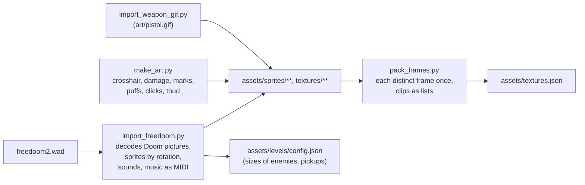

# Textures and animation

## Purpose

Every picture the game draws (wall textures, sprites, the weapon in hand,
HUD digits, the sky, menu backgrounds) is loaded once at startup by the
`TextureManager` from a manifest, and addressed afterwards by a dense
integer id. Animations are views into the manager's lists of frame ids,
so playing one allocates nothing. The art itself is produced offline by
scripts, mostly imported from Freedoom.

Code: `src/TextureManager/`, `src/Animation/`, `assets/textures.json`, and
the importers in `scripts/`.

## Concepts

### Sprites seen from eight sides

*Doom* draws a monster with up to eight pictures per animation frame, one
per 45° sector round it: from the front, front-left, left, back-left and
so on. Which picture to show depends on the angle between where the
monster faces and where the viewer stands. Freedoom follows the same
convention (rotations 1 to 8, with some drawn as mirror images of others),
and so does this engine.

### An atlas of names, a table of ids

Code asks for art by name once ("sky", "soldier_walk"), when a renderer or
an enemy is built, and keeps the integer id. Every draw then indexes a
`std::vector<Texture>` directly: no hashing, no strings, per frame.

## How it is implemented here

### The manifest

`assets/textures.json` has three sections:

| Section | What | Example |
| --- | --- | --- |
| `textures` | Named single images | `"sky": "textures/sky.png"` |
| `walls` | Wall textures by map cell value: cell 1 is the first | `"textures/1.png"`, ..., `"textures/exit.png"` |
| `clips` | Animation clips: a list of frames, in order, which may repeat | `"soldier_walk": ["sprites/npc/soldier/frames/0.png", ...]` |

A clip that turns has eight entries: `soldier_walk` (seen from the front)
and `soldier_walk@2` to `soldier_walk@8`, going round from the front-left
to the front-right. An image used by several clips (or twice in one) is
loaded once: `TextureManager::Load` keeps a map from path to id while it
loads.

### Masks for shots

For every image of at most 512 by 512 pixels (sprites; walls and
backgrounds are bigger and never shot through), loading also builds a
**one-bit-per-pixel mask**: a pixel shows if its alpha is at least half:

```cpp title="src/TextureManager/src/texture_manager.cpp"
        if (image->w * image->h <= kMaskPixels) {
            SDL_Surface* rgba =
                SDL_ConvertSurfaceFormat(image, SDL_PIXELFORMAT_RGBA32, 0);
            if (rgba != nullptr) {
                constexpr std::uint8_t kHalf = 128;
                const auto* pixels =
                    static_cast<const std::uint8_t*>(rgba->pixels);
                manager->SetMask(
                    id, MaskOf(rgba->w, rgba->h, [&](int x, int y) {
                        return pixels[static_cast<std::ptrdiff_t>(y) *
                                          rgba->pitch +
                                      static_cast<std::ptrdiff_t>(x) * 4 + 3] >=
                               kHalf;
                    }));
                SDL_FreeSurface(rgba);
```
[View on GitHub](https://github.com/bilalkah/wolfenstein/blob/73aaf653bbc3b5dbb26be73432bb845df5e76c52/src/TextureManager/src/texture_manager.cpp#L104-L118){ .excerpt-source }

`IsSolidAt(id, across, down)` answers "does this frame show at this
point?" for [shots](combat.md), and `SolidRows(id)` gives the first and last
rows that show anything, so hit zones are measured on the visible figure,
not the padded frame. Each image also records the average colour of its top
rows (`top_colour`): the sky uses it above the picture when the player
looks higher than the picture reaches.

### Animations

A `LoopedAnimation` holds a `std::span<const std::uint16_t>` into the
manager's frame ids, a frame duration and a counter. For a turning clip it
also finds the seven other sides' frames, building the `"<clip>@<n>"` name
**on the stack** so a level loads without allocating:

```cpp title="src/Animation/src/looped_animation.cpp"
LoopedAnimation::LoopedAnimation(const TextureManager& textures,
                                 std::string_view owner, std::string_view clip,
                                 double cycle_seconds)
    : LoopedAnimation(Clip(textures, owner, clip), 0.0) {
    frame_seconds_ = cycle_seconds / static_cast<double>(frames_.size());
    // The other sides, if the art turns: all of them, each as long, or none.
    // "<clip>@<view>" is built on the stack: a level loads without
    // allocating, enemies and their animations included.
    std::array<char, 64> name{};
    if (clip.size() + 2 > name.size()) {
        std::cerr << "Animation clip name too long: " << clip << '\n';
        std::exit(EXIT_FAILURE);
    }
    auto* const at = std::ranges::copy(clip, name.data()).out;
    *at = '@';
    const std::string_view side(name.data(), clip.size() + 2);
    for (std::size_t view = 1; view < kViews; ++view) {
        at[1] = static_cast<char>('1' + view);
        const auto frames = FindClip(textures, owner, side);
        if (frames.empty() && view == 1) {
            return;    // seen the same from every side
        }
        if (frames.size() != frames_.size()) {
            std::cerr << "Animation clip " << owner << '_' << side
                      << " is missing or not as long as the front's\n";
            std::exit(EXIT_FAILURE);
        }
        views_[view] = frames.data();
    }
    views_[0] = frames_.data();
}
```
[View on GitHub](https://github.com/bilalkah/wolfenstein/blob/73aaf653bbc3b5dbb26be73432bb845df5e76c52/src/Animation/src/looped_animation.cpp#L55-L85){ .excerpt-source }

### Which side is seen

```cpp title="src/Math/src/vector.cpp"
std::size_t SideSeen(const vector2d& at, double facing,
                     const vector2d& viewer) {
    const double turned = TurnedFrom(at, facing, viewer);
    const auto eighths =
        static_cast<long>(std::lround(-turned / (std::numbers::pi / 4)));
    return static_cast<std::size_t>(((eighths % 8) + 8) % 8);
}
```
[View on GitHub](https://github.com/bilalkah/wolfenstein/blob/73aaf653bbc3b5dbb26be73432bb845df5e76c52/src/Math/src/vector.cpp#L273-L279){ .excerpt-source }

`TurnedFrom` is the viewer's bearing relative to the object's facing, in
\([-\pi, \pi]\); rounding it to the nearest eighth of a turn picks the
view, 0 for straight ahead. Enemies and rockets use it; a dead enemy is
one frame drawn from its front, mirrored when seen from behind.

### The art pipeline



- `import_freedoom.py` reads `freedoom2.wad` directly: its lumps, the
  palette, Doom's column-post picture format and its sprite naming
  (`POSSA1`, `POSSA2A8`: frame A, rotation 1, rotation 2 and its mirror
  8). It writes frames, textures, sounds and the music as MIDI, and updates
  sizes in `config.json` so a sprite's world size matches its pixels.
- `render_music.sh` renders the MIDI to MP3 with FluidSynth and the
  FluidR3 soundfont, in a Docker container.
- `make_art.py` draws what Freedoom does not give: the crosshair, the red
  of a hit, the secret-wall crack, bullet marks, puffs, and synthesises a
  few sounds.
- `pack_frames.py` stores each animated sprite's frames **once**: an owner
  keeps a folder of its distinct frames, and clips list which they show,
  in order (`e024275`, "Store each animation frame once").

Every image, font, sound and track is stored with **Git LFS**
(`.gitattributes`); a clone without LFS has pointer files instead, and the
build scripts check for that.

## Design decisions and trade-offs

- **Loaded once, all of it.** About 500 distinct frames and textures,
  loaded at startup: no streaming, no hitch when a new enemy appears. The
  web build downloads them all before starting (16 MB of `index.data`).
- **Ids are `int` and frames `uint16_t`.** Clips of `uint16_t` ids keep the
  per-frame data tiny; the renderer and rays pass ids as `int`.
- **Masks only for small images.** A mask costs a bit a pixel; walls are
  never shot through, so they get none.
- **Unknown names exit.** `GetTextureId` and `GetTextureCollection` stop the
  program for a name the manifest lacks: code and manifest disagreeing is a
  build error, found at startup, not a missing picture found in play.

## Pitfalls

- **Views must be complete.** A turning clip needs all eight sides, each as
  long as the front; the constructor exits otherwise. The importer
  guarantees it.
- **Mirrored sides.** Doom stores some rotations as mirror images of
  others; the importer flips them when writing frames, so the engine never
  flips a sprite except for the dead (one frame, mirrored from behind).

## Possible improvements

- Pack the frames into a few atlases instead of hundreds of small textures,
  so consecutive sprite draws share a texture (fewer texture switches).
- Build the masks offline (in `pack_frames.py`) and ship them, saving
  startup time on the web.
