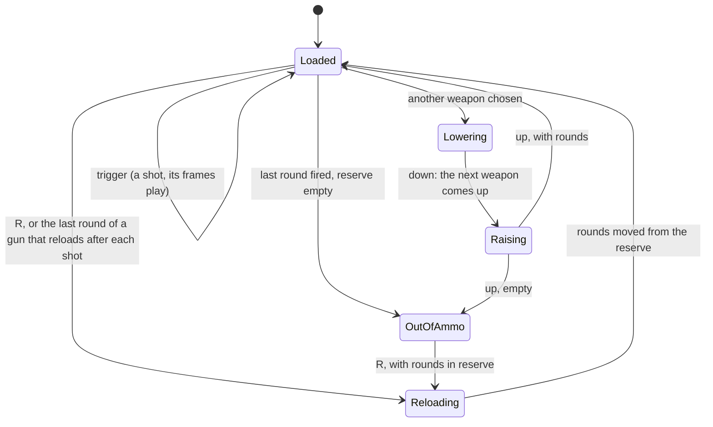

# Weapons and combat

## Purpose

This subsystem decides what happens when a trigger is pulled: whether the
weapon fires (loaded, not mid-shot, not reloading), what the shot hits,
where on the target, for how much damage, and what the world shows and
hears (a puff of blood or dust, a mark on the wall, a noise that wakes
enemies). It covers the player's seven weapons, rockets and plasma bolts,
and the enemies' simpler weapons.

Code: `src/Strike/` (`Weapon`, `SimpleWeapon`), `src/State/weapon_state.*`,
`src/ShootingManager/`, and `Scene::Launch`, `Fly`, `Burst`, `Wound`.

## Concepts

### Hitscan and projectiles

A **hitscan** weapon resolves its shot instantly along a line: whatever the
line meets first is hit. It is cheap and feels precise. A **projectile**
weapon launches an object that flies at a finite speed and resolves when it
meets something; it can be dodged and can have a blast radius. *Doom* has
both, and so does this game: the pistol, MP5, shotguns and saw are
hitscan (the saw with a short reach); the rocket launcher and plasma rifle
fire projectiles.

### Hitting a sprite

An enemy on screen is a flat picture facing the viewer. To make shots
agree with what the player sees, a shot should hit the enemy only where
its **picture** is (not the empty space beside a head or between legs),
and at the **height** the shot passes. This engine intersects the shot's
line with a vertical board at the enemy, the size of its picture, and
tests the picture's opacity there.

For a shooter at \(E\) facing \(\hat f\) and an enemy at \(C\), with
\(\vec{t} = C - E\), \(d = |\vec{t}|\) and \(\hat t = \vec t / d\), the
shot reaches the board through \(C\) (perpendicular to \(\hat t\)) after

\[
s = \frac{d}{\hat f \cdot \hat t}
\]

units, at a sideways offset \(o = (s\hat f - \vec t)\cdot \hat r\) (with
\(\hat r\) the viewer's right) and a height \(0.5 + p\,s\) (the eye is half
a wall up, and the shot climbs the pitch \(p\) per unit). Scaled by the
picture's width \(w\) and height \(h\):

\[
u = 0.5 + \frac{o}{w}, \qquad v = 1 - \frac{0.5 + p\,s}{h}
\]

A hit needs \(0 \le u, v < 1\) and the picture's pixel at \((u, v)\) at
least half opaque.

## How it is implemented here

### The arsenal

| Slot | Weapon | Magazine | Damage near / far | Range | Notes |
| --- | --- | --- | --- | --- | --- |
| 1 | Pistol | 8 | 18 / 6 | 10 | Carried from the start |
| 2 | MP5 | 30 | 14 / 5 | 9 | Automatic, 0.11 s a shot |
| 3 | Shotgun | 2 | 16 / 1 per pellet | 7 | 7 pellets across 8°, exponential falloff |
| 4 | Super shotgun | 1 | 16 / 1 per pellet | 7 | 20 pellets across 22°, reloads after each shot |
| 5 | Chainsaw | none | 9 / 7 | 1.3 | Melee; no rounds; its own hit sound |
| 6 | Rocket launcher | 4 | 40 direct | 20 | A rocket at 10 units/s; blast 1.8 units, 90 to 10 |
| 7 | Plasma rifle | 40 | 18 | 20 | A bolt at 16 units/s |

All of it lives in `config.json`: rounds, reserve (at start, at most, per
ammo box), damage, range, fire and reload times, falloff, kick, pellets and
spread, raise and lower times, sounds, how far the shot is heard, and the
projectile's own settings.

### Weapon states



`Weapon::Attack()` asks the current state to pull the trigger; only
`Loaded` fires (it decrements the magazine, plays the shot sound and
returns true), and only once per shot's duration (`attack_speed`). Holding
the trigger keeps the firing frames going (a saw cutting on). In
`OutOfAmmo`, pulling the trigger plays a dry click.

### A hitscan shot

`ResolvePlayerShot` fires one line per pellet, fanned evenly across the
spread. For each, `Aim` finds the nearest living enemy the line crosses (by
the board test above) before the wall the line hits; `ResolveOneShot` then
decides the zone and applies damage:

```cpp title="src/ShootingManager/src/shooting_manager.cpp"
std::optional<Crossing> Cross(const Scene& scene, const Position2D& eye,
                              double pitch, const Enemy& enemy) {
    const vector2d to = enemy.GetPose() - eye.pose;
    const double distance = to.Magnitude();
    constexpr double kTouching = 1e-9;
    if (distance < kTouching) {
        return std::nullopt;
    }
    const vector2d towards = to / distance;
    const vector2d facing{std::cos(eye.theta), std::sin(eye.theta)};
    const double approach = facing.Dot(towards);
    if (approach <= 0.0) {
        return std::nullopt;  // behind the shooter
    }
    // How far the shot flies to the board, and where on it it passes
    const double along = distance / approach;
    const vector2d off_centre = facing * along - to;
    const vector2d right{-towards.y, towards.x};  // the viewer's right
    const double across = 0.5 + off_centre.Dot(right) / enemy.GetWidth();
    const double down = 1.0 - (kEyeHeight + pitch * along) / enemy.GetHeight();
    if (across < 0.0 || across >= 1.0 || down < 0.0 || down >= 1.0 ||
        !scene.Textures().IsSolidAt(enemy.SeenFrom(eye.pose).texture_id, across,
                                    down)) {
        return std::nullopt;
    }
    return Crossing{.across = across, .down = down, .distance = along};
}
```
[View on GitHub](https://github.com/bilalkah/wolfenstein/blob/fab3414ad0f99c23307e2a7cb6a5b7beaadb0f61/src/ShootingManager/src/shooting_manager.cpp#L119-L145){ .excerpt-source }

`IsSolidAt` reads a one-bit-per-pixel mask the `TextureManager` built for
every sprite-sized texture at load (see [Textures and animation](assets.md)).
The mask belongs to **the frame the viewer sees**, so a soldier seen side-on
is thinner than one seen from the front.

### Where it hits: zones

The height at which the shot crossed, measured against the rows of the
frame that actually show something (`SolidRows`), picks a zone:

| Zone | Share of the figure (from the top) | Damage |
| --- | --- | --- |
| Head | top 20% | 2 times |
| Body | the middle | 1 time |
| Legs | bottom 45% | 0.6 times |

The shares and multipliers are `config.json`'s top-level `hit_zones`,
which an enemy type may override with its own (none does today). A headshot shows a larger burst of blood and a red hit
marker round the crosshair.

### Damage over distance

Each weapon's damage falls from its point-blank figure \(D_0\) to its
figure at range \(D_R\):

- **Linear**: \(D(d) = D_R + (D_0 - D_R)\,\dfrac{R - d}{R}\).
- **Exponential** (the shotguns): \(D(d) = \min(\max(e^{(R - d)/1.5},
  D_R), D_0)\): full damage up close, then falling fast, per pellet.

### Projectiles

`Scene::Launch` takes the oldest of 16 projectiles and sets it flying.
Every tick, `Scene::Fly` moves each one on in **steps of 0.05 units**
(shorter than any body is wide), bursting it at the first wall or closed
door, living enemy or lamp it meets:

- a direct hit wounds that enemy with the weapon's damage;
- the blast (the rocket's) hurts every enemy within its radius **in line of
  sight of the burst**, falling linearly from 90 at the centre to 10 at the
  edge; the player caught in their own blast takes half;
- the burst plays its sound where it happened and makes a noise.

### Marks and puffs

A hitscan shot that meets no enemy strikes the wall the line reaches: a
puff of dust at the height it hit, and a bullet mark on that wall's face,
kept in a ring of 32 per level (see [The 3D renderer](renderer.md)). A
shot that climbs over the wall's top or dips under the floor leaves no
mark.

### Enemies' weapons

An enemy carries a `SimpleWeapon` (damage near and far, range, attack
speed and rate, noise range). Enemies do not aim at pixels: an enemy that
decides to fire has the player in sight and in range, and its shot always
hits, with linear falloff and the difficulty's damage scale (see
[Enemy AI](ai.md)).

## Design decisions and trade-offs

- **Shots are resolved by the simulation.** The camera's centre ray is for
  drawing only (`GetCrosshairRay`: "shots are resolved by the simulation
  (Aim), not from the view"). A hit depends on game state, not on what was
  last drawn, which keeps it deterministic.
- **Hit only what shows** (`e024275`). Pixel masks cost one bit per pixel
  per sprite frame, once, at load, and make shots at the edge of a figure
  fair.
- **Pellets as separate hitscan lines**, fanned evenly (not randomly):
  the same shot always does the same thing.
- **Projectiles step through space.** Short fixed steps inside a tick
  instead of swept collision tests: simpler, and fine at these speeds.

## Pitfalls

- **Shots use the previous tick's facing** (see
  [One frame](../architecture/frame-lifecycle.md#pitfalls-in-this-order)).
- **The board is at the enemy's centre.** A shot grazing the side of a wide
  figure is tested against a board through its centre, not its outline in
  depth; for flat sprites that is exactly what is drawn.
- **Splash needs line of sight from the burst**, so a rocket bursting at a
  wall corner hurts nobody round it, even within the radius.

## Possible improvements

- Let enemies miss (see [Enemy AI](ai.md)).
- Knock-back from blasts.
- A per-weapon spread that grows while firing (recoil), shrinking at rest.
