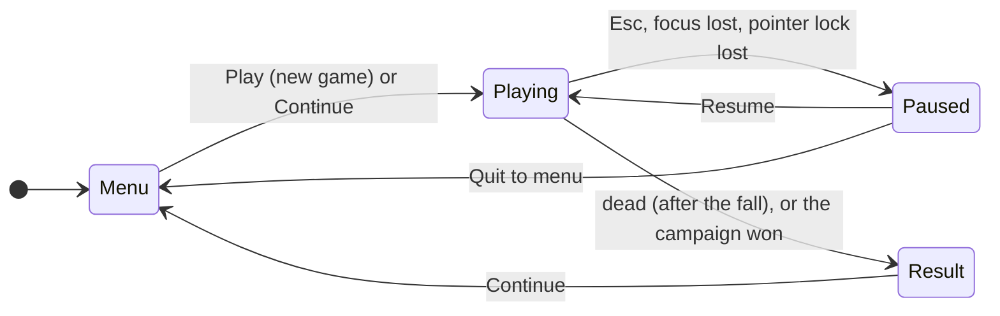
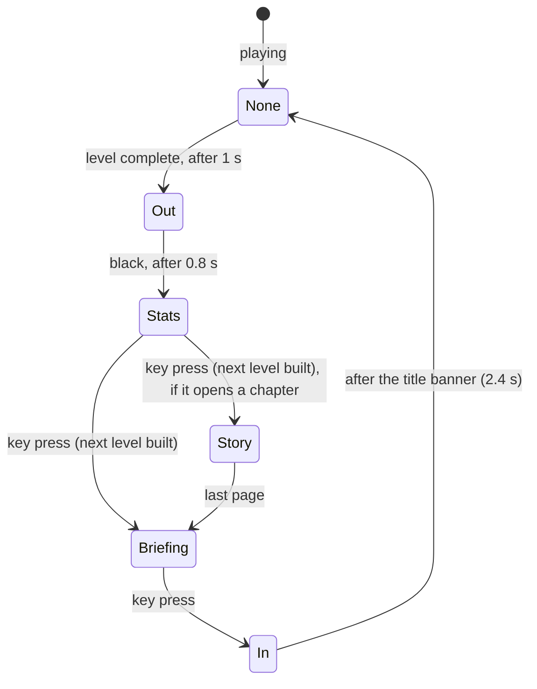

# Main loop and timing

## Purpose

The main loop decides what happens each frame: which screen is up (menu,
play, pause, results), how much simulated time the frame is worth, when
the simulation advances, and how the level fades into the next. It lives in
`Game` (`src/Core/src/game.cpp`), with the clocks in `src/TimeManager/`.

## Concepts

### Frames and ticks

A **frame** is one picture on the screen. Frames come as fast as the
display allows: 60 a second on most screens, 120, 144 or more on others,
fewer on a slow machine or a hidden browser tab. A **tick** is one step of
the simulation. If the simulation stepped once per frame by the frame's
duration, a game would play differently on different machines: collision
tests against a longer step can tunnel through thin walls, and floating
point sums differ with the step.

The standard remedy, described in Glenn Fiedler's
[*Fix Your Timestep!*](https://gafferongames.com/post/fix_your_timestep/),
is to simulate in **fixed ticks** and let frames fall wherever they fall:

- an **accumulator** collects each frame's real time;
- while it holds at least one tick's worth, one tick is simulated and the
  tick's time taken out;
- the remainder carries over to the next frame.

With a tick of \(\Delta t\), a frame of \(T\) seconds and an accumulator
\(a\):

\[
a \leftarrow a + \min(T, T_{max}), \qquad
n = \left\lfloor \frac{a}{\Delta t} \right\rfloor, \qquad
a \leftarrow a - n\,\Delta t
\]

The cap \(T_{max}\) guards against the **spiral of death**: after a long
stall, simulating all the missed ticks would make the next frame long too,
and so on. Capping the frame time drops the stall instead.

### Interpolation

A frame usually falls between two ticks. Drawing the latest tick's state
would make motion step at 60 Hz on a 144 Hz screen. So each moving thing
keeps its previous tick's pose, and the frame draws it
\(\alpha = a / \Delta t\) of the way to the latest one:

\[
p_{drawn} = p_{prev} + \alpha\,(p_{latest} - p_{prev})
\]

Angles are interpolated the short way round (a turn from \(179^\circ\) to
\(-179^\circ\) is \(2^\circ\), not \(358^\circ\)).

## How it is implemented here

### Game states



`Game::Tick` dispatches on the state; only `Playing` runs the simulation.
`Paused` keeps drawing the frozen level behind the pause menu.

```cpp title="src/Core/src/game.cpp"
bool Game::Tick() {
    if (soak_frames_ > 0) {
        SoakStep();
    }
    switch (state_) {
        case GameState::Menu:
            MenuTick();
            break;
        case GameState::Playing:
            GameTick();
            break;
        case GameState::Paused:
            PausedTick();
            break;
        case GameState::Result:
            ResultTick();
            break;
    }
    return running_;
}
```
[View on GitHub](https://github.com/bilalkah/wolfenstein/blob/73aaf653bbc3b5dbb26be73432bb845df5e76c52/src/Core/src/game.cpp#L565-L584){ .excerpt-source }

### The clocks

`FrameClock` measures the time between frames, unless a fixed delta is set
(the benchmark and the soak session set 1/60 s, so their runs are
reproducible):

```cpp title="src/TimeManager/src/time_manager.cpp"
void FrameClock::Tick() {
    const auto now = Clock::now();
    delta_ = fixed_delta_.count() > 0.0 ? fixed_delta_ : now - previous_;
    previous_ = now;
}
```
[View on GitHub](https://github.com/bilalkah/wolfenstein/blob/73aaf653bbc3b5dbb26be73432bb845df5e76c52/src/TimeManager/src/time_manager.cpp#L13-L17){ .excerpt-source }

`FixedStep` is the accumulator, with a tick of 1/60 s and frames capped at
a quarter of a second:

```cpp title="src/Core/include/Core/game.h"
    // The simulation runs at 60 ticks per second whatever the frame rate
    FixedStep step_{1.0 / 60.0, 0.25};
    // The input of the frames since the last tick, for the next
    PlayerCommand pending_;
```
[View on GitHub](https://github.com/bilalkah/wolfenstein/blob/73aaf653bbc3b5dbb26be73432bb845df5e76c52/src/Core/include/Core/game.h#L202-L205){ .excerpt-source }

```cpp title="src/TimeManager/src/time_manager.cpp"
int FixedStep::Advance(double frame_seconds) {
    accumulator_ += std::min(frame_seconds, max_frame_seconds_);
    int ticks = 0;
    while (accumulator_ >= tick_seconds_) {
        accumulator_ -= tick_seconds_;
        ++ticks;
    }
    return ticks;
}
```
[View on GitHub](https://github.com/bilalkah/wolfenstein/blob/73aaf653bbc3b5dbb26be73432bb845df5e76c52/src/TimeManager/src/time_manager.cpp#L39-L47){ .excerpt-source }

`Alpha()` is `accumulator_ / tick_seconds_`, and `Reset()` forgets time
not yet simulated: `Game::ShowLevel` calls it after loading a level, so
loading is not one long frame.

### Interpolated drawing

Every moving object remembers where it was at the previous tick. The
player:

```cpp title="src/Characters/src/player.cpp"
Position2D Player::GetRenderPosition(double alpha) const {
    return Interpolate(previous_position_, position_, alpha);
}
```
[View on GitHub](https://github.com/bilalkah/wolfenstein/blob/73aaf653bbc3b5dbb26be73432bb845df5e76c52/src/Characters/src/player.cpp#L181-L183){ .excerpt-source }

```cpp title="src/Characters/include/Characters/character.h"
inline Position2D Interpolate(const Position2D& from, const Position2D& to,
                              double alpha) {
    const double turn =
        std::remainder(to.theta - from.theta, 2.0 * std::numbers::pi);
    return {Interpolate(from.pose, to.pose, alpha), from.theta + turn * alpha};
}
```
[View on GitHub](https://github.com/bilalkah/wolfenstein/blob/73aaf653bbc3b5dbb26be73432bb845df5e76c52/src/Characters/include/Characters/character.h#L36-L41){ .excerpt-source }

`std::remainder` with \(2\pi\) returns the difference in \([-\pi, \pi]\):
the short way round. Enemies and projectiles override
`IGameObject::GetRenderPose(alpha)` the same way; the camera asks every
object for it when it places sprites. The player's **view angle** is the
exception: it is not interpolated at all but taken from `ViewAngles`,
which the input turns every frame (see [Input](input.md)).

### Pacing

Natively, `GameTick` sleeps after each frame so frames are at least
1/120 s apart (`FrameClock::SleepForHz(config_.fps)`, with `fps` 120 in
`main.cpp`). In the browser, `emscripten_set_main_loop_arg(..., 0, true)`
with a frame rate of 0 lets `requestAnimationFrame` pace the loop, so the
game draws at the display's rate. Scripted runs do not sleep at all.

### Between levels

A cleared level does not cut straight to the next. `Game` runs a small
state machine of its own, `Fade`:

```cpp title="src/Core/include/Core/game.h"
    // Between levels: fading out of the cleared one, or into the next
    // Out: to black after a cleared level; Stats: its results over black,
    // until the player goes on; Briefing: the next level's, likewise; In:
    // the level from black
    // Between levels: the story (the opening, a chapter's card, the
    // ending) comes before a level's briefing, and after its results
    enum class Fade : std::uint8_t { None, Out, Stats, Story, Briefing, In };
```
[View on GitHub](https://github.com/bilalkah/wolfenstein/blob/73aaf653bbc3b5dbb26be73432bb845df5e76c52/src/Core/include/Core/game.h#L214-L220){ .excerpt-source }



The next level replaces the cleared one when the player leaves the
results (`ContinueFromStats`), behind a black screen; after the campaign's
last level the ending is told instead and the victory screen follows.
While the fade is at `Stats`, `Story` or `Briefing`, the level's ticks are
skipped (see the loop in [One frame](../architecture/frame-lifecycle.md)),
so nothing moves behind the screens. Scripted runs turn these screens by
themselves after a set time.

## Design decisions and trade-offs

- **60 Hz ticks.** Enough for responsive movement and cheap enough for a
  whole level of enemies with pathfinding. The cost is that anything
  faster than a tick (a projectile) must step inside the tick itself:
  `Scene::Fly` moves a projectile in short steps so it cannot pass through
  a wall or a body.
- **Stalls are dropped, not caught up.** A breakpoint or a hidden browser
  tab would otherwise replay seconds of simulation at once.
- **Menus run on frame time.** `MenuTick`, `PausedTick` and `ResultTick`
  pass `clock_.DeltaTime()` straight to the UI: menu animations need no
  determinism.
- **The view turns per frame.** Mouse look is applied to the view at once,
  not at the next tick, because a view that lags the hand by a tick is
  felt (`d41e706`, "Aim where you look").

## Pitfalls

- `SleepForHz` truncates the remaining time to whole milliseconds
  (`duration_cast<milliseconds>`), so the native frame rate runs a little
  above 120 Hz, and the OS scheduler may sleep longer than asked.
- Code that runs once per *frame* must not change simulation state: it
  would run 0 to several times per tick depending on the display. The
  engine keeps such code in the presentation (`Game`, renderers,
  `ViewAngles`).
- Timers inside the simulation count tick time (`delta_time` given to
  `Update`), while fades and UI count frame time; mixing them up makes a
  screen last a different time at different frame rates.

## Possible improvements

- Record the commands of a session and replay them: with a deterministic
  simulation and a seeded random generator per enemy, a replay should
  reproduce the session exactly, which would make a strong regression
  test.
- Pace native frames with the display's vsync (`SDL_RENDERER_PRESENTVSYNC`)
  instead of sleeping.
