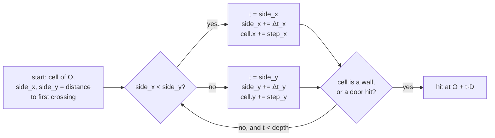

# Raycasting and the camera

## Purpose

The camera answers one question per screen column: **how far away is the
wall in that direction, and which part of which wall is it?** From those
answers the renderer draws the 3D view. The same machinery answers a few
more questions for the simulation: can this enemy see the player, what
does a shot hit, and which cells has the player seen (for the map).

Code: `src/Camera/` (`camera.cpp`, `raycaster.cpp`, `single_raycaster.cpp`,
`ray.h`).

<figure markdown="span">
  { width="420" }
  <figcaption>The 2D view (<code>?debug</code>, then P): the fan of rays from the player, enemies (circles) and the paths they plan.</figcaption>
</figure>

## Concepts

### A world of cells

The level is a grid. A cell is free floor, a wall (with a texture), or a
door. The player stands at a real-valued point \((x, y)\) facing an angle
\(\theta\). Because walls only ever sit on cell boundaries, the question
"what does a ray hit?" becomes "which cell boundary does the ray cross
first into a wall cell?". A 2.5D world like this is what *Wolfenstein 3D*
drew in 1992; Lode Vandevenne's
[raycasting tutorial](https://lodev.org/cgtutor/raycasting.html) is the
classic modern walkthrough.

### Walking a ray through the grid: DDA

A ray starts at \(O\) with a unit direction \(D = (\cos\phi, \sin\phi)\):
\(P(t) = O + t\,D\). It crosses the vertical grid lines \(x = k\) at

\[
t_x(k) = \frac{k - O_x}{D_x},
\]

so consecutive crossings are \(\Delta t_x = \left|1 / D_x\right|\) apart
along the ray, and likewise \(\Delta t_y = \left|1 / D_y\right|\) for
horizontal lines. The **DDA** (digital differential analyser) keeps the
distance to the next crossing on each axis and always advances the smaller
one, stepping one cell at a time into the cell the ray enters. It visits
exactly the cells the ray passes through, in order, and stops at the first
wall. This is the traversal described by Amanatides and Woo in
[*A Fast Voxel Traversal Algorithm for Ray Tracing*](http://www.cse.yorku.ca/~amana/research/grid.pdf)
(1987), in two dimensions.



### The fishbowl

If a wall's height on screen were taken from the Euclidean distance \(t\)
along each ray, a flat wall facing the viewer would bulge in the middle:
rays near the edge of the view travel further to reach the same flat wall.
The height must come from the **perpendicular** distance to the camera
plane:

\[
d_\perp = t \cos(\phi - \theta)
\]

where \(\phi\) is the ray's angle and \(\theta\) the view's. (The fix is
one of the project's first commits: `ef50b73`, "Fix fishbowl effect".)

### From distance to height

A wall is one unit tall. At distance \(d_\perp\) it spans

\[
h = \frac{P}{d_\perp}, \qquad P = H \cdot \frac{\text{FOV}_{base}}{\text{FOV}}
\]

pixels, where \(H\) is the screen height and \(P\) is "pixels per unit at
one unit away" (`PixelsPerUnit`). Widening the field of view shrinks
everything vertically as much as horizontally, so the picture keeps its
proportions. The eye is half a wall up, level with the horizon; the wall is
drawn from the horizon minus \((1 - e)\,h\) to the horizon plus \(e\,h\),
with \(e\) the eye height (0.5 alive; lower as a dead player falls).

### Which part of the texture

Where the ray meets the wall, the coordinate along the wall face is the
hit point's \(y\) for a face crossed along \(x\), and its \(x\) otherwise.
Its fractional part \(u \in [0, 1)\) picks the texture column:
\(\lfloor u \cdot w_{texture} \rfloor\).

## How it is implemented here

- `Camera2D` holds `width / 2` rays: **one ray per two screen columns**.
  With the default 1200-pixel-wide view that is 600 rays a frame.
- The rays are spread **evenly in angle** across the field of view:
  `RayCaster` starts at \(\theta - \text{FOV}/2\) and adds
  \(\Delta = \text{FOV} / (\text{width}/2)\) per ray. Screen columns map
  linearly to angles the same way (`CalculateHorizontalSlice`), for walls
  and sprites alike.
- `Cast` runs the DDA. It stops at a wall cell, at the closed part of a
  door, or after `depth` units (15, the view distance); beyond that the
  renderer draws a black column.
- Doors are **thin planes** across the middle of their cell, as in
  *Wolfenstein 3D*. A ray entering a door cell is intersected with that
  plane; if it meets the plane where the door still covers the doorway, it
  hits the door, and `texture_shift` makes the door's texture slide with
  it.
- A secret wall **sliding** between cells is not in the grid while it
  moves, so after the DDA every moving push wall is tested as an
  axis-aligned box with the slab method, and the nearer hit wins.
- The camera also places every visible object on screen (see below) and
  finds what the centre ray points at, for drawing only; shots are
  resolved by the simulation (see [Weapons and combat](combat.md)).

### Placing sprites

Enemies, lamps, pickups, puffs and projectiles are **billboards**: flat
pictures that always face the viewer. `Camera2D::Calculate` takes an
object's centre, finds the angle to it, and puts its left and right edges
half its width away on the line perpendicular to the line of sight. Their
angles relative to the view become screen columns; the object's distance
times the cosine of each edge's angle gives the perpendicular distance
that sizes it. An object whose edges fall outside the field of view, or
that is further than the view distance, is not drawn.

## Key code

### Preparing a ray

```cpp title="src/Camera/src/raycaster.cpp"
void PrepareRay(const Position2D& position, const double ray_theta, Ray& ray,
                vector2d& ray_unit_step, vector2d& ray_length_1d,
                vector2i& step, vector2i& map_check) {

    ray.Reset(position.pose, ray_theta);

    ray_unit_step.x =
        ray.direction.x == 0 ? 1e30 : std::abs(1 / ray.direction.x);
    ray_unit_step.y =
        ray.direction.y == 0 ? 1e30 : std::abs(1 / ray.direction.y);
    map_check.FromVector2d(ray.origin);

    if (ray.direction.x < 0) {
        step.x = -1;
        ray_length_1d.x =
            (ray.origin.x - double(map_check.x)) * ray_unit_step.x;
    }
    else {
        step.x = 1;
        ray_length_1d.x =
            (double(map_check.x + 1) - ray.origin.x) * ray_unit_step.x;
    }
    // ...
}
```
[View on GitHub](https://github.com/bilalkah/wolfenstein/blob/73aaf653bbc3b5dbb26be73432bb845df5e76c52/src/Camera/src/raycaster.cpp#L146-L179){ .excerpt-source }

`ray_unit_step` is \((\Delta t_x, \Delta t_y)\); `ray_length_1d` is the
distance along the ray to the first crossing on each axis. A direction
parallel to an axis gets \(10^{30}\) instead of a division by zero.

### The DDA loop

```cpp title="src/Camera/src/raycaster.cpp"
Ray Cast(const Map& map, const Position2D& position, double ray_theta,
         double depth) {
    const auto cells = map.GetCells();
    const auto row_size = static_cast<int>(cells.extent(0));
    const auto col_size = static_cast<int>(cells.extent(1));
    Ray ray;
    vector2d ray_unit_step, ray_length_1d;
    vector2i step, map_check;
    PrepareRay(position, ray_theta, ray, ray_unit_step, ray_length_1d, step,
               map_check);

    while (!ray.is_hit && ray.distance < depth) {
        if (ray_length_1d.x < ray_length_1d.y) {
            ray.is_hit_vertical = true;
            ray.perpendicular_distance = ray_length_1d.x;
            ray.distance = ray_length_1d.x;
            ray_length_1d.x += ray_unit_step.x;
            map_check.x += step.x;
        }
        else {
            ray.is_hit_vertical = false;
            ray.perpendicular_distance = ray_length_1d.y;
            ray.distance = ray_length_1d.y;
            ray_length_1d.y += ray_unit_step.y;
            map_check.y += step.y;
        }

        if (map_check.x >= 0 && map_check.x < row_size && map_check.y >= 0 &&
            map_check.y < col_size) {
            const auto cell = cells[static_cast<std::size_t>(map_check.x),
                                    static_cast<std::size_t>(map_check.y)];
            if (Map::IsDoorCell(cell)) {
                if (HitDoor(ray, map.GetDoors()[cell - Map::kDoorCell])) {
                    ray.wall_id = cell;
                }
            }
            else if (cell != 0) {
                ray.is_hit = true;
                ray.hit_point = ray.origin + ray.direction * ray.distance;
                ray.wall_id = cell;
            }
        }
    }
    HitMovingPushWalls(ray, map, depth);
    return ray;
}
```
[View on GitHub](https://github.com/bilalkah/wolfenstein/blob/73aaf653bbc3b5dbb26be73432bb845df5e76c52/src/Camera/src/raycaster.cpp#L99-L144){ .excerpt-source }

`cells[x, y]` is C++23's multidimensional subscript on a `std::mdspan`
over the map's one flat array of cells (see [std::mdspan](../techniques/mdspan.md)).
A wall cell's value is its texture id, so the hit tells the renderer both
*that* and *what* it hit.

### A door is a plane

```cpp title="src/Camera/src/raycaster.cpp"
bool HitDoor(Ray& ray, const Door& door) {
    const double plane = (door.across_x ? door.x : door.y) + 0.5;
    const double origin = door.across_x ? ray.origin.x : ray.origin.y;
    const double direction = door.across_x ? ray.direction.x : ray.direction.y;
    if (direction == 0.0) {
        return false;  // along the door, never through it
    }
    const double t = (plane - origin) / direction;
    if (t <= 0.0) {
        return false;
    }
    const vector2d point = ray.origin + ray.direction * t;
    const double along = door.across_x ? point.y - door.y : point.x - door.x;
    if (along < door.openness || along >= 1.0) {
        return false;  // through the open part
    }
    ray.is_hit = true;
    ray.distance = t;
    ray.perpendicular_distance = t;
    ray.hit_point = point;
    ray.is_hit_vertical = door.across_x;
    ray.texture_shift = door.openness;
    return true;
}
```
[View on GitHub](https://github.com/bilalkah/wolfenstein/blob/73aaf653bbc3b5dbb26be73432bb845df5e76c52/src/Camera/src/raycaster.cpp#L21-L44){ .excerpt-source }

The door's plane is \(x = x_{door} + 0.5\) (or \(y\)); the ray meets it at
\(t = (plane - O)/D\). The door slides sideways as it opens: the part of
the doorway from 0 to `openness` is clear.

### The fan of rays

```cpp title="src/Camera/src/raycaster.cpp"
void RayCaster::Update(const Map& map, const Position2D& position,
                       RayVector& rays) const {
    double ray_theta = position.theta - (fov_ / 2);
    for (auto& ray : rays) {
        ray = Cast(map, position, ray_theta, depth_);
        ray_theta += delta_theta_;
    }
}
```
[View on GitHub](https://github.com/bilalkah/wolfenstein/blob/73aaf653bbc3b5dbb26be73432bb845df5e76c52/src/Camera/src/raycaster.cpp#L183-L190){ .excerpt-source }

### Correcting the fishbowl and picking the texture column

The correction happens in the renderer, where each ray becomes a column:

```cpp title="src/Graphics/src/renderer_3d.cpp"
void Renderer3D::RenderIfRayHit(const int& horizontal_slice, const Ray& ray) {
    const auto& camera_ptr = context_->GetCamera();
    const auto distance = ray.perpendicular_distance *
                          std::cos(camera_ptr.GetPosition().theta - ray.theta);
    const auto [line_height, draw_start, draw_end] =
        CalculateVerticalSlice(distance);

    auto hit_point = ray.is_hit_vertical ? ray.hit_point.y : ray.hit_point.x;
    // A door slid part open shows the rest of its texture
    hit_point = std::fmod(hit_point, 1.0) - ray.texture_shift;
    // A wall ray's id is the map cell it hit; the manifest gives its texture
    const auto cell = static_cast<std::uint16_t>(ray.wall_id);
    const int wall_texture =
        Map::IsDoorCell(cell)
            ? door_textures_[static_cast<std::size_t>(
                  scene_->GetMap().GetDoors()[cell - Map::kDoorCell].lock)]
            : context_->Textures().GetWallTexture(ray.wall_id);
    const auto& texture = context_->Textures().GetTexture(wall_texture);
    const auto texture_height = texture.height;
    const auto texture_width = texture.width;
    int texture_point = static_cast<int>(hit_point * texture_width);

    // One texel wide: two would squeeze a pair of texels into the column,
    // which stripes a low-resolution texture seen up close
    SDL_Rect src_rect = {texture_point, 0, 1, texture_height};
    SDL_Rect dest_rect = {horizontal_slice, draw_start, 2, line_height};
    Enqueue(wall_texture, src_rect, dest_rect, distance);
```
[View on GitHub](https://github.com/bilalkah/wolfenstein/blob/73aaf653bbc3b5dbb26be73432bb845df5e76c52/src/Graphics/src/renderer_3d.cpp#L228-L254){ .excerpt-source }

### Line of sight

Enemies check whether they can see the player with the same DDA, from
their position towards the player's, stopping at the first blocked cell
(a wall or a closed door): `CastLineOfSight` in
[`single_raycaster.cpp`](https://github.com/bilalkah/wolfenstein/blob/73aaf653bbc3b5dbb26be73432bb845df5e76c52/src/Camera/src/single_raycaster.cpp).
It is a pure function of the map and two points, so any system can use it:
enemies seeing the player, the positional audio muffling sounds behind
walls, tactics choosing spots in sight of the player.

## Design decisions and trade-offs

- **One ray per two columns.** Half the rays for half the cost; each ray's
  column is drawn two pixels wide from a one-texel-wide slice of the
  texture. At 1200 pixels across that is still finer than the
  low-resolution Freedoom textures, so it does not show.
- **Equal angles between rays.** Simple, and walls and sprites use the same
  angle-to-column mapping, so they line up. The classic alternative spaces
  rays evenly on a camera *plane* (column \(x\) proportional to
  \(\tan\phi\)); see *Pitfalls*.
- **Rendering by the GPU, not a framebuffer.** Each column is a
  `SDL_RenderCopy` of a one-texel-wide strip of the wall texture; SDL's
  accelerated renderer (WebGL in the browser) scales it. No software pixel
  loop, but one draw command per column (see [The 3D renderer](renderer.md)).
- **Doors as planes, push walls as boxes.** Both are handled at the point
  where a ray meets them, not by changing the grid, so a moving door or
  wall needs no rebuild of anything.

## Pitfalls

- **`perpendicular_distance` is not perpendicular yet.** The DDA stores the
  distance along the ray in both `Ray::distance` and
  `Ray::perpendicular_distance`; the renderer applies the cosine. Code that
  uses a ray's `perpendicular_distance` straight from `Cast` gets the
  Euclidean distance.
- **Equal-angle projection bends lines.** With columns linear in angle
  rather than in \(\tan\phi\), a straight wall seen at a slant has a very
  slightly curved top and bottom edge, more so at the 80° maximum field of
  view. It is consistent (sprites use the same mapping), so nothing tears.
- **Texture coordinate across a face.** The texture column is the
  fractional part of the hit coordinate, whichever side the wall is seen
  from, so a texture is mirrored on two of a cell's four faces. Pictures
  hung on walls correct for this: see the intel decals in
  [The 3D renderer](renderer.md).
- **Near-zero distances.** Standing against a wall makes \(d_\perp \to 0\)
  and the height infinite; `CalculateVerticalSlice` clamps the distance to
  0.01 and the height to 32 screen heights before converting to `int`
  (converting an out-of-range double to `int` is undefined behaviour).

## Possible improvements

- Cast rays on a camera plane (direction \(\text{dir} + \text{plane}
  \cdot x\), as in Lode's tutorial) and map sprites the same way, to
  remove the slight bending at wide fields of view.
- Cast one ray per column at high resolutions, or cast fewer rays and
  interpolate on slow devices, chosen at run time.
- Floors and ceilings are flat colours and a sky picture; textured floors
  would need a per-pixel (or per-row) pass, which the current
  draw-command design does not have.
