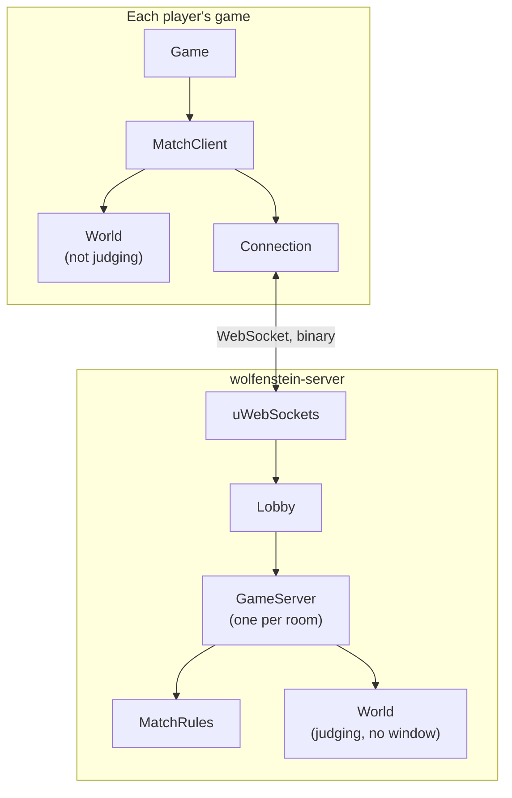
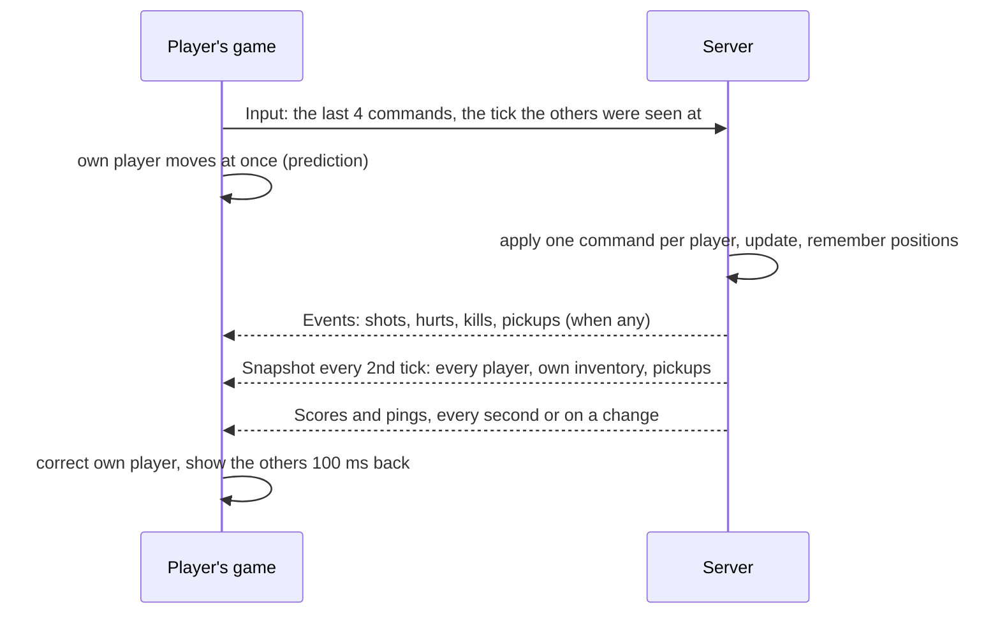

# Multiplayer

A free-for-all for up to eight players, in the browser and the native game
together. Two modes: **deathmatch** (weapons, rounds and medkits lie about
and come back) and **gun race** (each kill moves the killer up a ladder of
weapons; a kill with the last wins).

## The pieces

| Module | Job |
| --- | --- |
| `src/Net` | The protocol (messages packed into bytes) and `Connection` (a WebSocket, received messages kept in a fixed inbox) |
| `src/Client` | `MatchClient`: a player's side: sends commands, predicts, corrects, shows the others, plays events |
| `src/Server` | `GameServer` (one match), `MatchRules` (frags, respawns, modes), `Lobby` (the open match and private rooms) |
| `server/main.cpp` | The server program: uWebSockets, a timer ticking every match 60 times a second |

Both sides run the same `World`: the engine's simulation is deterministic
and driven only by commands, which is what makes prediction possible.

## One tick

## Who decides what

| | Player's game | Server |
| --- | --- | --- |
| Own movement | predicts it | decides it |
| Own shots | shows the sound, blood, hit marker at once | judges the hit |
| Health, death, respawn, pickups, frags | shows what the server says | decides |
| The other players | shows them 100 ms in the past | moves them by their commands |

A player's game sets its scene to **not judging**: its shots find the
other players but hurt no one there.

## The algorithms

### Prediction and reconciliation

1. Each command is numbered, applied at once, and kept in a history of 128
   with the position it led to.
2. A snapshot says where the server had the player after command `ack`.
3. Within 0.01 cells of the history's position: nothing to do (the usual
   case, since both run the same code).
4. Otherwise: put the player there and **replay** the commands after
   `ack` (movement only, no shots or sounds).

Weapons and rounds are corrected the same way, by the difference between
the server's and what was foreseen, so a correction never undoes shots
fired since.

### Snapshot interpolation

The others are placed where the snapshots had them **6 ticks (100 ms)**
behind the newest, interpolated between the two snapshots round that
moment (a ring of 32). Three snapshots of margin: one late snapshot
does not freeze anyone.

### Lag compensation

- The server remembers where every player stood for the last **30 ticks**
  (half a second).
- Each command says which tick its game showed the others at.
- A shot is tested against the targets **where the shooter saw them**. A
  target down now, or not there then, cannot be hit.

### The command queue

The server applies one command per player per tick. When the next one is
late, the player repeats the last (moving and holding the trigger, not
pressing keys again); when commands pile up after a stall, the queue is
cut to the last two. Commands travel four at a time, so a stalled message
costs none.

### Round trip (ping)

Once a second the game sends its clock; the server echoes it at once. The
round trip is measured from when the answer **arrived** (stamped by the
connection), not from the frame that reads it. Each player reports its
own; the server sends everyone's with the scores.

## The protocol

Binary WebSocket messages: a type byte, then little-endian fields.
Positions are 1/256 of a cell in 16 bits, angles 1/65536 of a turn.

| Message | Direction | Content |
| --- | --- | --- |
| `Hello` / `Welcome` / `Reject` | join | version and name / slot, tick, arena / why not |
| `Input` | player → server, every tick | 4 numbered commands, the tick seen (50 bytes) |
| `Snapshot` | server → player, 30/s | each player's place, health, weapon; own inventory; pickups gone (< 140 bytes for 8) |
| `Events` | server → players | shots, rockets, hurts, kills, pickups |
| `Scores`, `Pings` | server → players, 1/s | mode, clock, names, frags, deaths, pings |
| `Ping` / `Pong` | round trip | clocks |

A version number turns away a game of another version. New messages can
be added without a new version: an older game ignores what it does not
know.

## Matches

- **Frags**: +1 per kill, −1 for killing yourself.
- **Respawn**: after 3 s (1 s with a click), at the spawn point **farthest
  from the living players** (the one whose nearest player is farthest),
  shielded for 1.5 s or until firing.
- **Pickups** come back after 15 to 30 s.
- **End**: first to 20 frags, or the leader after 10 minutes; the result
  shows for 10 s, then the next match starts on the next arena.
- **Rooms**: `ws://host:8080/room/CODE` is a private match, created on
  first join, closed a minute after it empties.
- **Dropped connection**: the game rejoins by itself (5 tries); the
  server returns a player's score if it comes back under the same name
  within a minute.

## Cost

Eight players on one server: about 1.7% of a CPU core, 4.5 MB of memory,
0.6 Mbit/s. A server fight allocates no memory.

See [Building and hosting](building.md) to run a server.
