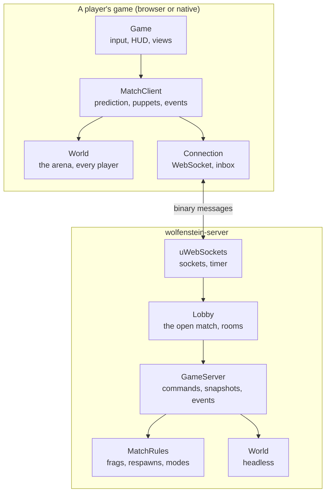
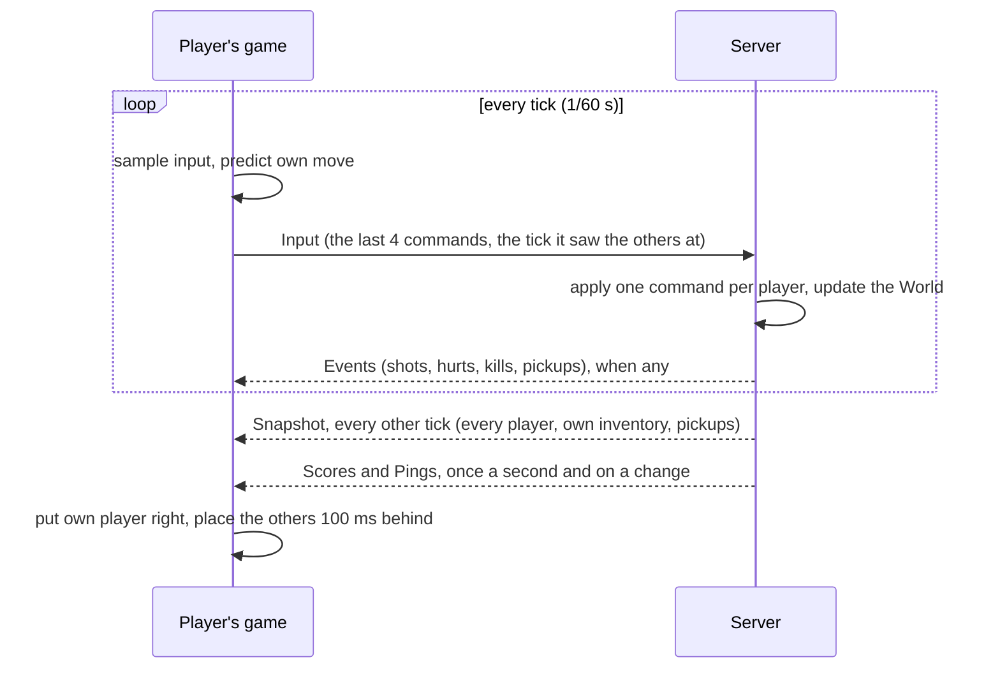

# Multiplayer

## Purpose

A free-for-all deathmatch for up to eight players, in the browser and the
native game together, on a server that runs in a container. Two modes:
**deathmatch**, where the guns, rounds and medkits lie about the arena and
come back after they are taken, and a **gun race**, where each kill moves
the killer to the next weapon of a ladder and a kill with the last one
wins. There are no teams. The game's levels are not played; two arenas
were drawn for it, in the manner of the maps shooters are played on:
lanes, doors where they meet, cover and loops.

Code: `src/Net/` (the protocol, the connection), `src/Server/` (the
server's game, its rules, its rooms), `src/Client/` (a player's side),
`server/main.cpp` (the server program), and the match's parts of
`src/Core/src/game.cpp` and `src/Core/src/scene.cpp`.

## Playing

On a local network, one machine runs the server and serves the web game
(see [Hosting a game](hosting.md)); everyone opens the page, chooses
**MULTIPLAYER** in the main menu, types a name and joins. The screen
offers the server beside the page, so the address needs no typing. A
**room** keeps a group's match apart from the server's open one: players
who type the same word play together.

A link joins straight away: `?server=ws://host:8080&name=ann` in the
page's address, or `--connect ws://host:8080 --name ann` for the native
game.

In a match, **Tab** shows the scoreboard; the frags, the place and the
match's clock stand under the corner map, the latest kills at the top
left, and the round trip to the server (the ping, in milliseconds) under
the frame rate. A player shot down comes back after three seconds, or
after one with a click.

## The pieces

| Piece | What it does |
| --- | --- |
| `net::` protocol (`Net/protocol.h`) | The messages, packed into a few bytes each, read and written without allocating |
| `net::Connection` (`Net/connection.h`) | A WebSocket to the server: the browser's own through Emscripten, IXWebSocket natively; what comes in waits in a fixed inbox |
| `MatchClient` (`Client/match_client.h`) | A player's side: says hello, sends each tick's command, moves its own player at once and puts it right, places the others, plays what the server tells |
| `GameServer` (`Server/game_server.h`) | One match: lets players in, applies their commands a tick at a time, judges shots in hindsight, tells everyone how things stand |
| `MatchRules` (`Server/match_rules.h`) | How the match is won: frags, coming back, pickups returning, the modes, the limits, the intermission |
| `Lobby` (`Server/lobby.h`) | The matches one server holds: the open one, and a match for each room |
| `server/main.cpp` | The program: uWebSockets, a timer that ticks the lobby 60 times a second, a room for each address |

The same `World` and `Scene` run everywhere: in the server, with no window
and no sound, and in each player's game, drawn. That is what the engine's
[deterministic, command-driven simulation](../features/deterministic-simulation.md)
was for: a player's game runs the very code the server runs, so it can
foresee its own player's moves.

## A tick, both sides

## What it costs

Measured with eight scripted players fighting on one server in a
container: about 1.7% of a CPU core, 4.5 MB of memory, and 0.6 Mbit/s
sent. Each player sends about 3 KB/s. A small cloud machine could hold
many matches.

## Where to go next

- [Prediction, lag and who decides](netcode.md): how a player's game and
  the server share the work, so a move is felt at once and a shot aimed
  true hits.
- [The protocol](protocol.md): the messages, their bytes, and how the
  protocol grows without breaking older games.
- [Matches, modes and rooms](matches.md): the rules, the arenas, the
  rooms, coming back after a drop.
- [Hosting a game](hosting.md): on a local network, in Docker, and on the
  internet behind Caddy.
- [How multiplayer was built](../features/multiplayer.md): the milestones
  and their commits.
