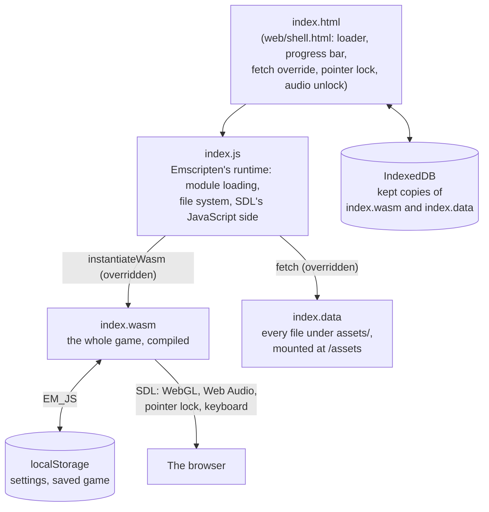

# How the WebAssembly port works

The same C++ that builds the desktop game builds the browser game. Nothing
in the simulation or the renderer knows it runs in a browser; the
differences live in the build flags, the page the game runs in
(`web/shell.html`), and a handful of `#ifdef __EMSCRIPTEN__` blocks (see
[Platform layer](../engine/platform.md#what-differs-on-the-web)).

## The pieces

| File | Size | Gzipped (as GitHub Pages sends it) |
| --- | --- | --- |
| `index.wasm` | 3.1 MB | 1.2 MB |
| `index.data` | 15.4 MB | 14.0 MB (mostly PNG and MP3, already compressed) |
| `index.js` | 0.23 MB | 0.05 MB |
| `index.html` | 8 KB | 3.4 KB |

Sizes of the build at the documented commit.

## What happens when the page opens

1. The page shows its loader and starts two downloads: `index.wasm`
   (through `Module.instantiateWasm`, which the page overrides) and
   `index.data` (Emscripten's file packager fetches it; the page replaces
   `window.fetch` for that URL). Both go through the page's own
   downloader, which keeps the files in IndexedDB so the next visit
   downloads nothing unless the build changed. See
   [Downloading and caching](loading-and-caching.md).
2. The wasm is compiled while it streams in
   (`WebAssembly.instantiateStreaming`).
3. The data package is unpacked into Emscripten's in-memory file system at
   `/assets`, where the game reads it exactly as it reads the repository's
   `assets/` natively (`RESOURCE_DIR`).
4. `main()` runs: SDL creates a WebGL context on the canvas, the game loads
   every texture, sound, level and track (as natively), and
   `Game::Run` hands the loop to the browser
   (`emscripten_set_main_loop_arg`). See
   [Main loop, input and pointer lock](main-loop-and-input.md).
5. The page's watchdog hears `onGameReady`. A game that fails to start
   (a broken download) makes the page clear its kept copies and reload
   once, before showing an error.

## Pages in this section

- [Building with Emscripten](emscripten-build.md): flags, ports, the
  preloaded assets, output files, the pinned SDK.
- [Main loop, input and pointer lock](main-loop-and-input.md): who owns the
  loop, capturing the mouse, keys, focus, iframes.
- [Downloading and caching](loading-and-caching.md): the page's loader,
  pieces and stalls, IndexedDB, compressed servers such as GitHub Pages.
- [Audio in the browser](audio.md): the audio context, unlocking it, the
  mixer on the main thread.
- [Storage](storage.md): `localStorage` from C++, IndexedDB from the page.
- [Limitations](limitations.md): what the browser build cannot do, and why.
